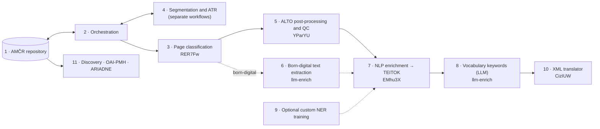

# [\#4 Issue](https://github.com/ufal/atrium-project/issues/4) `open`: SSH Open Marketplace records for all our tools used in our workflows
**Labels**: `documentation`

#### [stranak](https://github.com/stranak) opened issue at [2026-03-13 12:47](https://github.com/ufal/atrium-project/issues/4):

[SSH Open Marketplace](https://marketplace.sshopencloud.eu/search?q=AMCR+Digital+Archive) records for all our tools used in our workflows
- [x] UDPipe
- [x] NameTag
- [ ] ???

#### [K4TEL](https://github.com/K4TEL) commented at [2026-03-15 13:46](https://github.com/ufal/atrium-project/issues/4#issuecomment-4063024069):

https://marketplace.sshopencloud.eu/tool-or-service/RER7Fw/version/81629

Historical documents page classifier - added as Suggested Tool in the `ATRIUM catalogue` keyword

https://github.com/ufal/atrium-page-classification - added

#### [K4TEL](https://github.com/K4TEL) commented at [2026-04-11 17:07](https://github.com/ufal/atrium-project/issues/4#issuecomment-4229826414):

The remaining 3 repositories were suggested as tools

#### [K4TEL](https://github.com/K4TEL) commented at [2026-04-16 17:26](https://github.com/ufal/atrium-project/issues/4#issuecomment-4262099215):

- [ALTO XMLS post-processor](https://marketplace.sshopencloud.eu/tool-or-service/YParYU)
- [NLP enrichment](https://marketplace.sshopencloud.eu/tool-or-service/EMhu3X)
- [XMLs translator](https://marketplace.sshopencloud.eu/tool-or-service/CizIUW)
- [Page classifier](https://marketplace.sshopencloud.eu/tool-or-service/RER7Fw)

All uploaded as tool-or-service under the **ATRIUM catalogue** tag

#### [K4TEL](https://github.com/K4TEL) commented at [2026-06-19 17:55](https://github.com/ufal/atrium-project/issues/4#issuecomment-4753739822):

Add licenses of tools into workflowws/tools description:

- [x] https://github.com/ufal/atrium-page-classification
- [x] https://github.com/ufal/atrium-alto-postprocess
- [x] https://github.com/ufal/atrium-nlp-enrich
- [x] https://github.com/ufal/atrium-translator

#### [K4TEL](https://github.com/K4TEL) commented at [2026-06-19 18:03](https://github.com/ufal/atrium-project/issues/4#issuecomment-4753775352):

https://marketplace.sshopencloud.eu/tool-or-service/YParYU/version/87577 - done

https://marketplace.sshopencloud.eu/tool-or-service/EMhu3X/version/87580 - done

https://marketplace.sshopencloud.eu/tool-or-service/CizIUW/version/87581 - done

https://marketplace.sshopencloud.eu/tool-or-service/RER7Fw/version/87582 - done

https://marketplace.sshopencloud.eu/search?order=score&q=ATRIUM&categories=workflow&f.keyword=ATRIUM+catalogue&f.language=English - workflows - 500 error - probably best to keep them as they are

#### [K4TEL](https://github.com/K4TEL) commented at [2026-09-07 08:34](https://github.com/ufal/atrium-project/issues/4#issuecomment-5567773433):

**This *is* WP4's contractual deliverable**, and records already exist (§3) — completion, not authoring. hub **#17 · "Review workflow descriptions in SSHOMP"** and **#4 · "SSH Open Marketplace records for all our tools used in our workflows"**.

  - Bring records to the DMP standard: step-by-step sequence, inputs/outputs per step, formats, provenance, limitations, TaDiRAH tags, alt-texted images, PIDs.
  - **Add the missing llm-enrich tool record**, the **born-digital variant** as a second workflow, and **fold in the Grobid rejection** where a reviewer will read it.

#### [K4TEL](https://github.com/K4TEL) commented at [2026-09-11 10:45](https://github.com/ufal/atrium-project/issues/4#issuecomment-5633281406):

https://marketplace.sshopencloud.eu/workflow/13eHAZ - Task of the XML files translator supporting vocabulary and preserving input files structure

https://marketplace.sshopencloud.eu/tool-or-service/EMhu3X - NLP enrichment of the ordered text lines extracted from PDF and recorded in CSV

https://marketplace.sshopencloud.eu/tool-or-service/CizIUW - Translator of XML files supporting vocabulary and preserving input structure

https://marketplace.sshopencloud.eu/tool-or-service/RER7Fw - Historical documents page classifier

https://marketplace.sshopencloud.eu/tool-or-service/YParYU - ALTO XMLs post-processing and quality control (text lines categorization)

The records in my ownership are above

#### [motyc](https://github.com/motyc) commented at [2026-09-24 16:15](https://github.com/ufal/atrium-project/issues/4#issuecomment-5817855309):

@K4TEL, a request for one new SSHOMP record, plus two notes. Some context first, as the workflow update is new (to land today or tomorrow).

**What is changing in `0xSpVP`.** We are rewriting the AMČR text workflow [0xSpVP](https://marketplace.sshopencloud.eu/workflow/0xSpVP), last updated in November 2025, to match the current tool chain. It will link your four tool records and describe the chain step by step. The numbers are the step numbers in the new text:

**Request: an llm-enrich tool record.** llm-enrich is the only tool in the chain without a record, and two steps link to it:

- step 8, vocabulary keywords. This replaces KER in the workflow: the text is mapped onto the AMČR and TEATER vocabularies, with the output constrained to the vocabulary;
- step 6, the born-digital converter (PDF and DOCX into the document record).

One record for the repository is enough, like RER7Fw, YParYU, EMhu3X and CizIUW. A separate record for the converter would only make sense if it ships as its own service. Suggested properties, following the other four records:

- keyword `ATRIUM catalogue`
- activities `Content Analysis`, `Enriching`, `Extracting`
- input formats `CSV`, `TEI`, `TXT`, `PDF`, `DOCX`; output format `JSON`
- a licence statement for the code and for the model output, including the remote-provider case
- TRL as on the other records

**Born-digital: a branch, not a second workflow.** Your comment of 7 September suggested the born-digital variant as a second workflow. We put it inside `0xSpVP` instead, as step 6, which replaces steps 4–5 for files with a usable text layer. T4.1.2 names digital-born extraction as part of the basic workflow. The GROBID note from `atrium-llm-enrich#11` is in that step.

**Existing records, when you next edit them.** The descriptions date from July. They do not mention the API service images, and EMhu3X still names KER. There is no hurry, because `0xSpVP` links the records rather than repeating them.

Once the llm-enrich record exists, please add its link here and I will link it from steps 6 and 8.

#### [motyc](https://github.com/motyc) commented at [2026-09-24 19:01](https://github.com/ufal/atrium-project/issues/4#issuecomment-5820363634):

Complete workflow update submitted now: https://marketplace.sshopencloud.eu/workflow/0xSpVP/version/106039 (will be visible after approval).

#### [K4TEL](https://github.com/K4TEL) commented at [2026-09-25 05:54](https://github.com/ufal/atrium-project/issues/4#issuecomment-5827555777):

https://marketplace.sshopencloud.eu/tool-or-service/j9fqxo/version/106118 - LLM keyword mapping onto archaeological vocabularies (AMČR, TEATER) and born-digital PDF/DOCX conversion

Added draft of the LLM-enrich repo tool

Working on updates for existing 4 tools

**TODO**: drawio diagram of LLM-enrich repo should be added to SSH OMP media of its record

P.S.

Updated and submitted all 5 tool records for review

#### [K4TEL](https://github.com/K4TEL) commented at [2026-09-25 09:54](https://github.com/ufal/atrium-project/issues/4#issuecomment-5830437406):

### Update by Opus 5.5 — 2026-09-25: record texts

- All 5 tool records submitted today (incl. new `j9fqxo`); the approved versions still show the July texts until moderation.
- Decided: rebuild `13eHAZ` with steps, and add a workflow record for the page classifier. Paste sheets: `agent_dev_logs/plans/4.plan.md` B5 and Appendix C, taken from the new hub Workflows pages.
- Appendix D lists phrases in today's submissions that will date (defaults, model names, unreleased inputs in `YParYU`), for the next edit.

**Next**: after moderation, check the public versions · rebuild `13eHAZ` · create the pc workflow record · llm-enrich diagram for `j9fqxo` media

#### [motyc](https://github.com/motyc) commented at [2026-09-26 16:27](https://github.com/ufal/atrium-project/issues/4#issuecomment-5847891755):

@K4TEL, thank you for [j9fqxo](https://marketplace.sshopencloud.eu/tool-or-service/j9fqxo). Once it is approved, we will link it from the keyword and born-digital steps of [0xSpVP](https://marketplace.sshopencloud.eu/workflow/0xSpVP).

One request for the two new workflow records you plan, the rebuilt `13eHAZ` and the page-classifier workflow: please let each describe its own tool's workflow and link `0xSpVP` for the full AMČR chain, rather than repeat it. The chain is then described once, in one place. Your Appendix D fits the same idea: we keep `0xSpVP` free of issue numbers, dates and version details, so it does not date.

#### [K4TEL](https://github.com/K4TEL) commented at [2026-09-26 20:51](https://github.com/ufal/atrium-project/issues/4#issuecomment-5849776512):

Will do. The rebuilt `13eHAZ` and the page-classifier workflow will describe only their own tool and link `0xSpVP` for the chain. We leave their version fields out, since the tool records carry the versions. The page classifier's routing step becomes a pointer to `0xSpVP`. I'll post both links here once they are submitted.

-------------------------------------------------------------------------------

[Export of Github issue for [ufal/atrium-project](https://github.com/ufal/atrium-project). Generated on 2026.09.26 at 23:02:32.]
