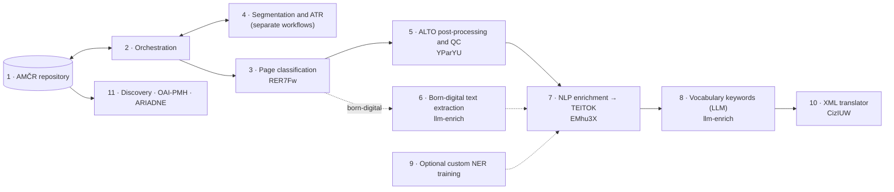

# [\#4 Issue](https://github.com/ufal/atrium-project/issues/4) `open`: SSH Open Marketplace records for all our tools used in our workflows
**Labels**: `documentation`

#### [stranak](https://github.com/stranak) opened issue at [2026-03-13 12:47](https://github.com/ufal/atrium-project/issues/4):

[SSH Open Marketplace](https://marketplace.sshopencloud.eu/search?q=AMCR+Digital+Archive) records for all our tools used in our workflows
- [x] UDPipe
- [x] NameTag
- [ ] ???

#### [K4TEL](https://github.com/K4TEL) commented at [2026-03-15 13:46](https://github.com/ufal/atrium-project/issues/4#issuecomment-4063024069):

https://marketplace.sshopencloud.eu/tool-or-service/RER7Fw/version/81629

Historical documents page classifier - added as Suggested Tool in the `ATRIUM catalogue` keyword

https://github.com/ufal/atrium-page-classification - added

#### [K4TEL](https://github.com/K4TEL) commented at [2026-04-11 17:07](https://github.com/ufal/atrium-project/issues/4#issuecomment-4229826414):

The remaining 3 repositories were suggested as tools

#### [K4TEL](https://github.com/K4TEL) commented at [2026-04-16 17:26](https://github.com/ufal/atrium-project/issues/4#issuecomment-4262099215):

- [ALTO XMLS post-processor](https://marketplace.sshopencloud.eu/tool-or-service/YParYU)
- [NLP enrichment](https://marketplace.sshopencloud.eu/tool-or-service/EMhu3X)
- [XMLs translator](https://marketplace.sshopencloud.eu/tool-or-service/CizIUW)
- [Page classifier](https://marketplace.sshopencloud.eu/tool-or-service/RER7Fw)

All uploaded as tool-or-service under the **ATRIUM catalogue** tag

#### [K4TEL](https://github.com/K4TEL) commented at [2026-06-19 17:55](https://github.com/ufal/atrium-project/issues/4#issuecomment-4753739822):

Add licenses of tools into workflowws/tools description:

- [x] https://github.com/ufal/atrium-page-classification
- [x] https://github.com/ufal/atrium-alto-postprocess
- [x] https://github.com/ufal/atrium-nlp-enrich
- [x] https://github.com/ufal/atrium-translator

#### [K4TEL](https://github.com/K4TEL) commented at [2026-06-19 18:03](https://github.com/ufal/atrium-project/issues/4#issuecomment-4753775352):

https://marketplace.sshopencloud.eu/tool-or-service/YParYU/version/87577 - done

https://marketplace.sshopencloud.eu/tool-or-service/EMhu3X/version/87580 - done

https://marketplace.sshopencloud.eu/tool-or-service/CizIUW/version/87581 - done

https://marketplace.sshopencloud.eu/tool-or-service/RER7Fw/version/87582 - done

https://marketplace.sshopencloud.eu/search?order=score&q=ATRIUM&categories=workflow&f.keyword=ATRIUM+catalogue&f.language=English - workflows - 500 error - probably best to keep them as they are

#### [K4TEL](https://github.com/K4TEL) commented at [2026-09-07 08:34](https://github.com/ufal/atrium-project/issues/4#issuecomment-5567773433):

**This *is* WP4's contractual deliverable**, and records already exist (§3) — completion, not authoring. hub **#17 · "Review workflow descriptions in SSHOMP"** and **#4 · "SSH Open Marketplace records for all our tools used in our workflows"**.

  - Bring records to the DMP standard: step-by-step sequence, inputs/outputs per step, formats, provenance, limitations, TaDiRAH tags, alt-texted images, PIDs.
  - **Add the missing llm-enrich tool record**, the **born-digital variant** as a second workflow, and **fold in the Grobid rejection** where a reviewer will read it.

#### [K4TEL](https://github.com/K4TEL) commented at [2026-09-11 10:45](https://github.com/ufal/atrium-project/issues/4#issuecomment-5633281406):

https://marketplace.sshopencloud.eu/workflow/13eHAZ - Task of the XML files translator supporting vocabulary and preserving input files structure

https://marketplace.sshopencloud.eu/tool-or-service/EMhu3X - NLP enrichment of the ordered text lines extracted from PDF and recorded in CSV

https://marketplace.sshopencloud.eu/tool-or-service/CizIUW - Translator of XML files supporting vocabulary and preserving input structure

https://marketplace.sshopencloud.eu/tool-or-service/RER7Fw - Historical documents page classifier

https://marketplace.sshopencloud.eu/tool-or-service/YParYU - ALTO XMLs post-processing and quality control (text lines categorization)

The records in my ownership are above

#### [motyc](https://github.com/motyc) commented at [2026-09-24 16:15](https://github.com/ufal/atrium-project/issues/4#issuecomment-5817855309):

@K4TEL, a request for one new SSHOMP record, plus two notes. Some context first, as the workflow update is new (to land today or tomorrow).

**What is changing in `0xSpVP`.** We are rewriting the AMČR text workflow [0xSpVP](https://marketplace.sshopencloud.eu/workflow/0xSpVP), last updated in November 2025, to match the current tool chain. It will link your four tool records and describe the chain step by step. The numbers are the step numbers in the new text:

```mermaid
flowchart LR
  R[("1 · AMČR repository")] <--> O["2 · Orchestration"]
  O <--> ATR["4 · Segmentation and ATR<br/>(separate workflows)"]
  O --> PC["3 · Page classification<br/>RER7Fw"]
  PC --> AP["5 · ALTO post-processing and QC<br/>YParYU"]
  PC -. "born-digital" .-> DC["6 · Born-digital text extraction<br/>llm-enrich"]
  AP --> NLP["7 · NLP enrichment → TEITOK<br/>EMhu3X"]
  DC -.-> NLP
  NLP --> KW["8 · Vocabulary keywords (LLM)<br/>llm-enrich"]
  KW --> TR["10 · XML translator<br/>CizIUW"]
  T["9 · Optional custom NER training"] -.-> NLP
  R --> D["11 · Discovery · OAI-PMH · ARIADNE"]
```

**Request: an llm-enrich tool record.** llm-enrich is the only tool in the chain without a record, and two steps link to it:

- step 8, vocabulary keywords. This replaces KER in the workflow: the text is mapped onto the AMČR and TEATER vocabularies, with the output constrained to the vocabulary;
- step 6, the born-digital converter (PDF and DOCX into the document record).

One record for the repository is enough, like RER7Fw, YParYU, EMhu3X and CizIUW. A separate record for the converter would only make sense if it ships as its own service. Suggested properties, following the other four records:

- keyword `ATRIUM catalogue`
- activities `Content Analysis`, `Enriching`, `Extracting`
- input formats `CSV`, `TEI`, `TXT`, `PDF`, `DOCX`; output format `JSON`
- a licence statement for the code and for the model output, including the remote-provider case
- TRL as on the other records

**Born-digital: a branch, not a second workflow.** Your comment of 7 September suggested the born-digital variant as a second workflow. We put it inside `0xSpVP` instead, as step 6, which replaces steps 4–5 for files with a usable text layer. T4.1.2 names digital-born extraction as part of the basic workflow. The GROBID note from `atrium-llm-enrich#11` is in that step.

**Existing records, when you next edit them.** The descriptions date from July. They do not mention the API service images, and EMhu3X still names KER. There is no hurry, because `0xSpVP` links the records rather than repeating them.

Once the llm-enrich record exists, please add its link here and I will link it from steps 6 and 8.

#### [motyc](https://github.com/motyc) commented at [2026-09-24 19:01](https://github.com/ufal/atrium-project/issues/4#issuecomment-5820363634):

Complete workflow update submitted now: https://marketplace.sshopencloud.eu/workflow/0xSpVP/version/106039 (will be visible after approval).

#### [K4TEL](https://github.com/K4TEL) commented at [2026-09-25 05:54](https://github.com/ufal/atrium-project/issues/4#issuecomment-5827555777):

https://marketplace.sshopencloud.eu/tool-or-service/j9fqxo/version/106118 - LLM keyword mapping onto archaeological vocabularies (AMČR, TEATER) and born-digital PDF/DOCX conversion

Added draft of the LLM-enrich repo tool

Working on updates for existing 4 tools

**TODO**: drawio diagram of LLM-enrich repo should be added to SSH OMP media of its record

P.S.

Updated and submitted all 5 tool records for review

#### [K4TEL](https://github.com/K4TEL) commented at [2026-09-25 09:54](https://github.com/ufal/atrium-project/issues/4#issuecomment-5830437406):

### Update by Opus 5.5 — 2026-09-25: record texts

- All 5 tool records submitted today (incl. new `j9fqxo`); the approved versions still show the July texts until moderation.
- Decided: rebuild `13eHAZ` with steps, and add a workflow record for the page classifier. Paste sheets: `agent_dev_logs/plans/4.plan.md` B5 and Appendix C, taken from the new hub Workflows pages.
- Appendix D lists phrases in today's submissions that will date (defaults, model names, unreleased inputs in `YParYU`), for the next edit.

**Next**: after moderation, check the public versions · rebuild `13eHAZ` · create the pc workflow record · llm-enrich diagram for `j9fqxo` media

#### [motyc](https://github.com/motyc) commented at [2026-09-26 16:27](https://github.com/ufal/atrium-project/issues/4#issuecomment-5847891755):

@K4TEL, thank you for [j9fqxo](https://marketplace.sshopencloud.eu/tool-or-service/j9fqxo). Once it is approved, we will link it from the keyword and born-digital steps of [0xSpVP](https://marketplace.sshopencloud.eu/workflow/0xSpVP).

One request for the two new workflow records you plan, the rebuilt `13eHAZ` and the page-classifier workflow: please let each describe its own tool's workflow and link `0xSpVP` for the full AMČR chain, rather than repeat it. The chain is then described once, in one place. Your Appendix D fits the same idea: we keep `0xSpVP` free of issue numbers, dates and version details, so it does not date.

#### [K4TEL](https://github.com/K4TEL) commented at [2026-09-26 20:51](https://github.com/ufal/atrium-project/issues/4#issuecomment-5849776512):

Will do. The rebuilt `13eHAZ` and the page-classifier workflow will describe only their own tool and link `0xSpVP` for the chain. We leave their version fields out, since the tool records carry the versions. The page classifier's routing step becomes a pointer to `0xSpVP`. I'll post both links here once they are submitted.

#### [K4TEL](https://github.com/K4TEL) commented at [2026-09-30 16:25](https://github.com/ufal/atrium-project/issues/4#issuecomment-5915350105):

The repository moves agreed on Wednesday change three of our tool records. We'll edit them once the versions now in moderation are public:
- the llm-enrich record (`j9fqxo`) describes the LLM keyword step, which becomes keyword-extractor. We'll re-point it rather than add a second record.
- the born-digital converter (ufal/atrium-digital-convert#1) gets a record of its own.
- the alto-postprocess record is renamed to ocr-postprocess, and the nlp-enrich record drops keyword extraction.

In `0xSpVP`, only the tools linked from the keyword step and the born-digital step change.

#### [K4TEL](https://github.com/K4TEL) commented at [2026-10-06 17:20](https://github.com/ufal/atrium-project/issues/4#issuecomment-6021631891):

@motyc, below are the texts of our tool records for your check before I submit them. Each describes the tool's newest release, and its licence rows follow the repository's `para_config.txt` at that release.

<b>Step 3 · <code>RER7Fw</code></b> · page classifier, v1.9.2-beta: one row, one sentence

The API renders PDFs with pypdfium2 since v1.9.1-beta, so the PyMuPDF row becomes:

| Component | License | Status | Compliance Details |
| :---- | :---- | :---- | :---- |
| pypdfium2 | Apache-2.0 | 🟢 Friendly | API only: renders the pages of an uploaded PDF. |

The text also stops giving the page count of the training data, since the current models were trained on a subset.

<b>Step 5 · <code>YParYU</code></b> → <code>ufal/atrium-ocr-postprocess</code>, v1.9.1-beta

**Label:** OCR output post-processing and quality control (text-line categorization)

**Formats:** input ALTO, PAGE XML, hOCR, JSON, PDF, DOCX, HTML, TEI, TXT · output ALTO, CSV, TXT, JSON

> Turns OCR output into clean, classified text lines. The pipeline splits documents into pages, builds page statistics tables, extracts each page's text in reading order, from the ALTO geometry or with a layout-aware model, and labels every text line by language and OCR quality: Clear, Noisy, Trash, Non-text or Empty. The quality score combines structural checks, a small language model's perplexity and character-level measures; the language comes from a language-identification model.
>
> Input: ALTO XML and other OCR output (PAGE XML, hOCR, ABBYY FineReader XML, OCR JSON), and text-bearing files such as PDF, office documents, HTML, TEI or plain text. Output: per-page ALTO and plain text, page statistics and per-line tables (CSV), and the ATRIUM document record (JSON), with a paradata JSON log per run.
>
> Command-line pipeline, or REST API container image (`ghcr.io/ufal/atrium-ocr-postprocess-api`): `/process` for a file, `/score_record` for the lines of an existing ATRIUM document record. The tool continues atrium-alto-postprocess under a new name.
>
> | Component | License | Status | Compliance Details |
> | :---- | :---- | :---- | :---- |
> | Code; alto-tools (vendored) | MIT; Apache-2.0 | 🟢 Friendly | Page split, statistics and text extraction. |
> | FastText language identification | CC BY-NC 4.0 | 🔴 Problematic | Used on every run: output is CC BY-NC 4.0 at minimum. |
> | LayoutReader (LayoutLMv3) | CC BY-NC-SA 4.0 | 🔴 Problematic | Layout-aware reading order: such runs resolve to CC BY-NC-SA 4.0. |
> | Qwen2.5-0.5B, distilgpt2 | Apache-2.0 | 🟢 Friendly | Perplexity models. |
> | GLM-4v-9b (optional) | GLM-4 licence | 🟡 Depends | Model-specific terms; check before commercial use. |
> | pypdfium2, charset-normalizer | Apache-2.0, MIT | 🟢 Friendly | Readers for PDF and plain-text files. |

<b>Step 6 · new record</b> → <code>ufal/atrium-digital-convert</code>, v1.1.1-beta

**Label:** Born-digital document converter: PDF and office files into structured text without OCR

**Properties:** licence MIT · input PDF, DOCX, ODT, ODS, XLSX, RTF, DOC, XLS · output JSON, Markdown · activities Converting, Extracting · keyword `ATRIUM catalogue` · related `0xSpVP`, `RER7Fw`, `YParYU`, `j9fqxo`

> Reads documents that were created on a computer rather than scanned, and writes their text with its structure into the ATRIUM document record (JSON), without OCR: pages, text lines in reading order grouped into blocks, and the headings, running headers and footers, footnotes and tables the format carries; for PDF also the position of every line. It reads PDF, DOCX, ODT, ODS, XLSX and RTF, and the legacy DOC and XLS through LibreOffice; the type is recognised from the file's content, not its extension.
>
> The text layer of every page is checked. A page without a text layer, with one that does not decode, or with one left by an earlier OCR run is flagged as needing OCR, with the reason, so that only such pages go to OCR; a PDF that is mostly an earlier OCR run is refused as not born-digital. On request the record is also rendered as annotated Markdown in reading order.
>
> REST API container image (`ghcr.io/ufal/atrium-digital-convert-api`): `/reformat` returns the record; `/describe` adds a per-page assessment with the suggested next step (NLP, OCR or handwritten text recognition), asking the ATRIUM page classifier and OCR post-processor when they are available. A command-line tool does the same conversion, and an optional layout-model engine (Docling) can be built locally for complex PDFs. The API returns the provenance of every run (paradata); the command line writes it on request.
>
> | Component | License | Status | Compliance Details |
> | :---- | :---- | :---- | :---- |
> | Code; pdfplumber, pdfminer.six, python-docx, lxml, jsonschema | MIT; BSD-3-Clause | 🟢 Friendly | Records resolve to MIT. |
> | pypdfium2 | Apache-2.0 | 🟢 Friendly | PDF page labels and text-layer checks. |
> | LibreOffice | MPL 2.0 | 🟢 Friendly | Converts DOC and XLS to DOCX and XLSX; not counted in the record's licence. |
> | Docling (optional, local build) | MIT; weights Apache-2.0, CDLA-Permissive-2.0 | 🟢 Friendly | Records still resolve to MIT. |
>
> The source document's own licence applies to its text.

<b>Step 7 · <code>EMhu3X</code></b> · <code>ufal/atrium-nlp-enrich</code>, v1.0.0-beta

**Label:** NLP enrichment of text lines into TEITOK (UDPipe 2, NameTag 3)

> Adds linguistic annotation and named entities to the text lines of archival documents: the line tables written by ATRIUM OCR post-processing (CSV or XLSX with a `text` column), or plain text. The lines go to the LINDAT UDPipe 2 service for tokens, lemmas, part-of-speech tags, morphological features and dependency syntax, and to the NameTag 3 service for named entities such as people, places and organisations.
>
> The main output is TEITOK XML, the TEI-based format of the TEITOK corpus platform; when the OCR's ALTO files are supplied, every word keeps its box on the page image. CoNLL-U files, entity tables per page and per document, a collection summary (CSV) and the ATRIUM document record (JSON) are also written, with a paradata JSON log per run. Documents that are not ALTO, such as PDF, office files, PAGE XML or hOCR, can first be converted into TEITOK with flexiconv on the command line.
>
> Command-line pipeline, or REST API container image (`ghcr.io/ufal/atrium-nlp-enrich-api`: `/enrich`, `/enrich_text`, background `/jobs`). Keywords are extracted by a separate tool, ATRIUM keyword extraction.
>
> | Component | License | Status | Compliance Details |
> | :---- | :---- | :---- | :---- |
> | Code; UDPipe 2 and NameTag 3 engines | MIT; MPL 2.0 | 🟢 Friendly | Engines called through the LINDAT services. |
> | UDPipe 2 and NameTag 3 models | CC BY-NC-SA 4.0 | 🔴 Problematic | Used on every run: output is CC BY-NC-SA 4.0 at minimum. |
> | flexiconv (optional) | GPL-3.0 | 🔴 Problematic | Only when documents are converted to TEITOK; command line only. |

<b>Step 8 · <code>j9fqxo</code></b> → <code>ufal/atrium-keyword-extract</code>, v1.0.0-beta

**Label:** Keyword extraction from archival documents (statistical and vocabulary-controlled)

**Formats:** input JSON, TXT, TEI, CoNLL-U (no longer PDF or DOCX) · output JSON, CSV

> Finds keywords in archival documents. Two kinds are kept apart, and every keyword says which method produced it, with its score and rank.
>
> **Statistical keywords** characterise a document and each of its pages: KeyBERT (embedding-based), YAKE, or the legacy KER method (lemma frequency). The REST API reads the ATRIUM document record, or plain text, and returns keywords per document and per page; a batch command line reads CoNLL-U or TEITOK files and writes CSV tables.
>
> **Vocabulary-controlled keywords** are terms of the AMČR keyword lists and the TEATER thesaurus, with Czech and English labels and a thematic category, chosen by a large language model whose output is constrained to the vocabulary's terms. This kind is at the research stage: it runs as a separate batch job on a GPU with a locally hosted model, and the API returns statistical keywords only.
>
> Container images for the REST API (`ghcr.io/ufal/atrium-keyword-extract-api`, `/extract_keywords`) and for both batch tools; every run records its provenance (paradata). The tool continues the keyword extraction of atrium-nlp-enrich and atrium-llm-enrich.
>
> | Component | License | Status | Compliance Details |
> | :---- | :---- | :---- | :---- |
> | Code; KER method | MIT | 🟢 Friendly | |
> | KeyBERT, sentence-transformers, embedding model | MIT, Apache-2.0 | 🟢 Friendly | KeyBERT runs. |
> | YAKE | AGPL-3.0 | 🔴 Problematic | Only when YAKE is selected; such a run is declared AGPL-3.0. |
> | AMČR keyword lists, TEATER thesaurus | CC0 | 🟢 Friendly | Vocabulary-controlled keywords. |
> | Locally hosted language model | Per model | 🟡 Depends | The model's own licence applies; see its model card. |
>
> The source document's own licence applies to its text.

<b>Step 10 · <code>CizIUW</code></b> · translator, v1.3.1-beta: two rows, two sentences

The vocabularies are CC0, so the permissive route no longer has to leave them out:

| Component | License | Status | Compliance Details |
| :---- | :---- | :---- | :---- |
| AMČR vocabularies, TEATER thesaurus | CC0 | 🟢 Friendly | Vocabulary data. |
| EuroLLM, MADLAD-400; OPUS-MT | Apache-2.0; CC BY 4.0 | 🟢 Friendly | Permissive route: one of these self-hosted, with the source language given. |

New sentences:
- "The command line can validate the output against an XSD schema; AMČR's own schema accepts replaced records only."
- "A reply that comes back empty, cut short or looping is requested again and never written."

**One question.** The keyword-extract API returns statistical keywords only. The vocabulary keywords of step 8 run as a separate research batch with a local model, and the `j9fqxo` text says so. Is that wording right for the record that step 8 links to? The remote-provider licence row is gone, as that code did not move to the new repository.

Once the texts are fine with you, I'll submit them and post the converter record's link here.

-------------------------------------------------------------------------------

[Export of Github issue for [ufal/atrium-project](https://github.com/ufal/atrium-project). Generated on 2026.10.08 at 14:21:45.]
