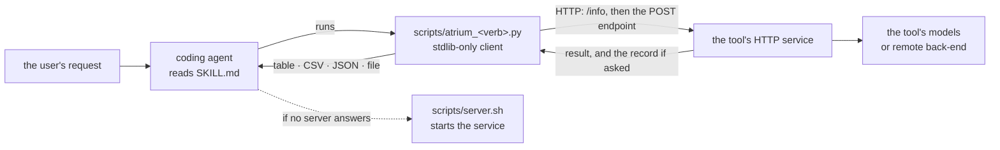

# Agent skills

Give a coding agent — Claude Code, Codex, Antigravity — the ability to call an ATRIUM tool,
without teaching it the tool's code.

!!! info "Scope"
    All five tools have an `agent-skill` branch. The two described below are
    page-classification's and the translator's; the other three follow the same pattern.

## What a skill is here

Each tool repository has a separate **`agent-skill` branch** — a reduced copy of the repository
that an agent can clone into its skills directory. It carries three things on top of the tool's
HTTP service:

| Part                       | What it does                                                                                                               |
|----------------------------|----------------------------------------------------------------------------------------------------------------------------|
| `SKILL.md`                 | the instructions the agent reads: when to use the skill, how to start the server, how to call it, what to do on each error |
| `scripts/atrium_<verb>.py` | a **zero-dependency client** — Python standard library only — that uploads files to the service and prints the result      |
| `scripts/server.sh`        | starts the service (Docker Compose, or a local `uvicorn`) and waits until it answers                                       |

The agent never imports the tool's code. It starts the service, then talks to it over HTTP —
which is what lets the same client point at a hosted instance by changing one environment
variable and nothing else:



**`SKILL.md`** follows the Agent Skills convention the agents share: a YAML frontmatter
block with a `name` and a `description` — the text an agent uses to decide *whether* the
skill applies — followed by Markdown instructions for *how* to use it. Only the frontmatter
is read up front; the body and the scripts are loaded when the skill is chosen, so an
installed skill costs almost nothing until it is used.

Compared with its default branch, each skill branch leaves out what an agent does not
need — the test suite, most workflows, `CONTRIBUTING.md`, `agent_dev_logs/`, lint and
coverage configuration, and modules the service does not import — and keeps the
`Dockerfile`, the compose files, the shared service module and the healthcheck unchanged,
so the service it starts is the same one the default branch publishes. The translator's
branch adds a small demonstration web page at `/frontend`.

## The two skills

=== "page-classification"

    **`name: atrium-page-classification`**

    > Classifies historical document page images (PNG/JPEG) and multipage PDFs into 11 structural
    > categories (text, handwritten, tables, drawings, photos) using fine-tuned ViT / RegNetY /
    > EffNetV2 models. Use this skill to route archival pages to the correct downstream processing
    > pipeline (OCR, HTR, table extraction, image handling).

    |                   |                                                                                       |
    |-------------------|---------------------------------------------------------------------------------------|
    | Service endpoints | `POST /predict_image` (PNG, JPEG) · `POST /predict_document` (PDF)                    |
    | Client            | `scripts/atrium_classify.py` — routes by file suffix; anything else is skipped        |
    | Server URL        | `--base-url`, or `ATRIUM_PC_URL`, default `http://localhost:8000`                     |
    | Limits            | 10 MB per file · 50 pages per PDF — pre-checked by the client for size only           |
    | Output            | a table, CSV or JSON of `FILE, PAGE, RANK, LABEL, SCORE`; page `1` for a single image |

    | Client flag                     | Default                                     |                                                                     |
    |---------------------------------|---------------------------------------------|---------------------------------------------------------------------|
    | `files…`                        | —                                           | images and/or PDFs                                                  |
    | `--base-url`                    | `$ATRIUM_PC_URL` or `http://localhost:8000` |                                                                     |
    | `--version`                     | `all`                                       | one revision, or `all` for the five-model ensemble                  |
    | `--topn`                        | `3`                                         |                                                                     |
    | `--format`                      | `table`                                     | `table` · `csv` · `json`                                            |
    | `--info`                        |                                             | print the models and categories the server offers, then exit        |
    | `--document-json PATH`          |                                             | a baseline record to add `page_categories` to — one input file only |
    | `--document-json-out`           |                                             | ask the service to originate a record even with no baseline         |
    | `--document-json-out-file PATH` |                                             | save the returned record — one input file only                      |

    What `SKILL.md` tells the agent, condensed: prefer `--version all`; report the top three and
    say so when scores are close rather than asserting a single label; convert TIFF to PNG first;
    downscale or split anything over the limits and tell the user; on exit 2 start the server and
    retry **once**; on exit 3 look at `/health?deep=true` and the logs.

=== "translator"

    **`name: atrium-translator`**

    > Translates archaeological archival XML documents - ALTO OCR pages or AMCR metadata records -
    > between languages (Czech-centric, default target English) via the LINDAT/CUBBITT NMT service,
    > preserving the XML structure and returning the translated document as a file. Use this skill
    > to make digitized historical documents readable in another language after OCR and quality
    > filtering, keeping ALTO layout or AMCR metadata fields intact.

    |                       |                                                                                                                                                                                            |
    |-----------------------|--------------------------------------------------------------------------------------------------------------------------------------------------------------------------------------------|
    | Service endpoint      | `POST /translate`                                                                                                                                                                          |
    | Client                | `scripts/atrium_translate.py` — `.xml` inputs only                                                                                                                                         |
    | Server URL            | `--base-url`, or `ATRIUM_TR_URL`, default `http://localhost:8000`                                                                                                                          |
    | Limits                | 50 MB per file, one XML document per request — pre-checked by the client                                                                                                                   |
    | Output                | the translated document as a file: `page.alto.xml` → `page_en.alto.xml`, `record.xml` → `record_en.xml`; with a baseline record, `multipart/mixed` carrying the XML and the updated record |
    | Needs at request time | outbound network — the default backend is LINDAT's translation API                                                                                                                         |

    | Client flag                     | Default                                            |                                                                  |
    |---------------------------------|----------------------------------------------------|------------------------------------------------------------------|
    | `files…`                        | —                                                  | ALTO pages or AMCR records                                       |
    | `--base-url`                    | `$ATRIUM_TR_URL` or `http://localhost:8000`        |                                                                  |
    | `--source-lang`                 | `auto`                                             | detection per `TextBlock`                                        |
    | `--target-lang`                 | `en`                                               |                                                                  |
    | `--alto` / `--no-alto`          | `--alto`                                           | `--no-alto` for AMCR metadata records                            |
    | `-o`, `--output FILE`           | the server-proposed name, in the current directory | `-` for stdout; one input file only                              |
    | `--info`                        |                                                    | print the service's capabilities and limits, then exit           |
    | `--document-json PATH`          |                                                    | a baseline record to add `translations` to — one input file only |
    | `--document-json-out-file PATH` | `<stem>.document.json`                             | requires `--document-json`                                       |

    What `SKILL.md` tells the agent, condensed: use `--no-alto` for metadata — a mismatch produces
    empty or mangled output rather than an error; keep `auto` unless the user names the language;
    check that the returned XML parses and report its path rather than pasting it; split anything
    over 50 MB. There is no GPU mode — the model runs at LINDAT, not here.

Both clients share one contract: **exit `0`** success · **`1`** a file not found or nothing
produced · **`2`** server unreachable · **`3`** HTTP error after retries. On `502`, `503` or `504`
they try **three times in total, ten seconds apart**. Every call uses one timeout — 300 s for the
classifier, 900 s for the translator.

## Installing

The branch *is* the skill. Clone it where the agent looks for skills:

=== "Claude Code"

    ```bash
    git clone -b agent-skill https://github.com/ufal/atrium-page-classification.git \
        ~/.claude/skills/atrium-page-classification
    git clone -b agent-skill https://github.com/ufal/atrium-translator.git \
        ~/.claude/skills/atrium-translator
    ```

    Restart the session; the skills appear as `/atrium-page-classification` and
    `/atrium-translator`. For a single project, clone into `.claude/skills/` inside it instead.

=== "Codex"

    ```bash
    git clone -b agent-skill https://github.com/ufal/atrium-page-classification.git \
        ~/.codex/skills/atrium-page-classification
    git clone -b agent-skill https://github.com/ufal/atrium-translator.git \
        ~/.codex/skills/atrium-translator
    ```

    Picked up in the next session.

=== "Antigravity"

    Clone the branch into the project, then add a pointer to it in the project's `AGENTS.md`
    naming `SKILL.md`, `scripts/server.sh` and the client script.

**Using a hosted service instead of a local one** — export the URL and skip `server.sh`:

```bash
export ATRIUM_PC_URL="https://<hosted-instance>/atrium-pc"
export ATRIUM_TR_URL="https://<hosted-instance>/atrium-tr"
```

Without a URL, the skill starts a local server with `scripts/server.sh`. Update an installed
skill with `git pull` inside its directory.

## The service contract the skills lean on

Every ATRIUM service implements the same meta-contract, from the hub-canonical
`service/atrium_service.py` — vendored byte-identically into both tools:

| Endpoint                | Answers                                                                                                                                                                                                                                                                             |
|-------------------------|-------------------------------------------------------------------------------------------------------------------------------------------------------------------------------------------------------------------------------------------------------------------------------------|
| `GET /info`             | `service` (the repository name), `version` (from `para_config.txt`, never hard-coded), `endpoints` (the live route list), `limits` (at least `max_upload_mb`), plus capabilities — the classifier adds `categories` and `available_models`; the translator adds `supported_formats` |
| `GET /health`           | `{"status": "ok"}`, always 200 while the process lives — liveness                                                                                                                                                                                                                   |
| `GET /health?deep=true` | 503 with a `detail` when a dependency is degraded, or while draining                                                                                                                                                                                                                |
| `GET /ready`            | 503 `starting` until warm-up completes; 200 when ready to serve; 503 `draining` after SIGTERM — readiness                                                                                                                                                                           |

The error codes are harmonised, so a client can treat all five services alike:

| Code                  | Meaning                          | What a client does                                 |
|-----------------------|----------------------------------|----------------------------------------------------|
| `413`                 | too large                        | report the limit; suggest splitting or downscaling |
| `415`                 | unsupported media type           | report the expected types                          |
| `422`                 | unusable input                   | report; do not retry                               |
| `429`                 | busy                             | report; the caller may retry later                 |
| `500`                 | processing failure               | report the detail; no blind retry                  |
| `502` · `503` · `504` | warming up, draining, or a proxy | retry                                              |

See [Operations](operations.md) for how these endpoints behave inside a container and under
Kubernetes.

## What CI checks on a skill branch

Each `agent-skill` branch calls the hub's `skill-validate.reusable.yml`, which checks:

1. **Frontmatter** — `name` is lowercase-hyphenated and equals the repository name; `description`
   is at least 60 characters.
2. **Referenced paths** — every backticked path in the skill's docs exists on the branch.
3. **The client stands alone** — it compiles and prints `--help` in a bare `python:3.11-slim`.
4. **Documented endpoints are real** — every `GET /x` or `POST /x` in the docs matches a route
   decorator, and the primary endpoints are served.
5. **The live contract** — in a `TestClient`: `/info` names the repository and version, advertises
   only real routes and a `max_upload_mb` limit; `/health` answers; the OpenAPI document validates.

Check 5 needs the service to import in CI; where it cannot — a service whose import pulls in
a large model stack, for example — the check reports a warning rather than failing. Starting
the server with `server.sh`, `/ready` and static mounts are outside the workflow's scope.

## Writing a skill for another tool

Start from the hub's templates in `docs/templates/skill/` — `SKILL.template.md`,
`atrium_client.skeleton.py`, `server.template.sh`, `serviceREADME.template.md` — and the
normative rules in `docs/agent_skill_strategy.md`: the service contract (§4), what the branch
must carry (§5), the client rules (§6) and the `SKILL.md` structure (§7). The templates carry
the conventions settled during the first rollout — starting the service by its compose
profile, polling `/info` until it answers, and the shared exit codes above.

## Sources

This table records **provenance**: what this page was written from, not a build instruction.

| Source                                                                         | What was taken from it        |
|--------------------------------------------------------------------------------|-------------------------------|
| `atrium-page-classification@agent-skill` — `SKILL.md`, `README.md`, `scripts/` | the page-classification skill |
| `atrium-translator@agent-skill` — the same files                               | the translator skill          |
| `atrium-project/docs/templates/shared/atrium_service.py`                       | the meta-contract             |
| `atrium-project/docs/skills_catalog.md`, `docs/agent_skill_strategy.md` §§4–7  | the normative contract        |
| `atrium-project/.github/workflows/skill-validate.reusable.yml`                 | what CI checks                |
| `atrium-project/docs/templates/skill/`                                         | the templates                 |
