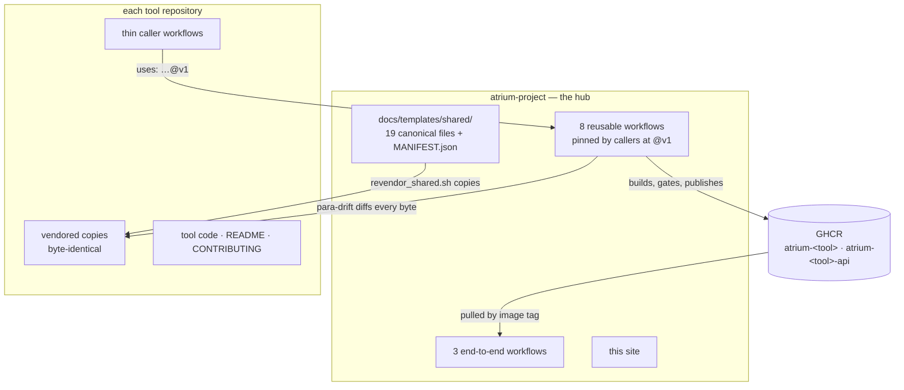
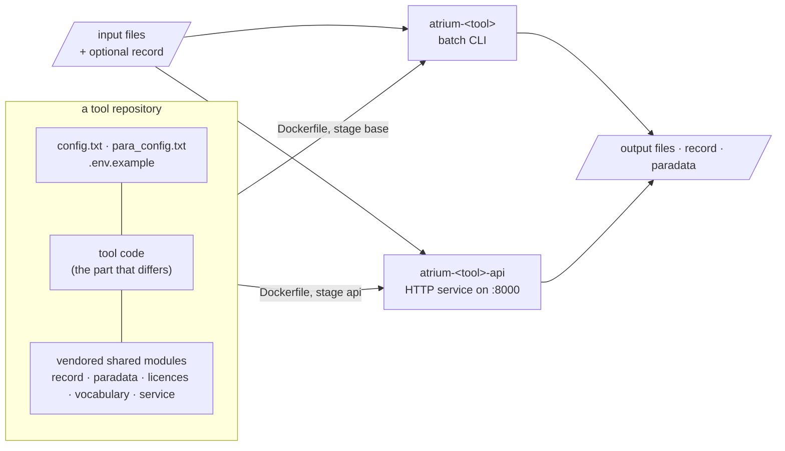

# Architecture

How the six repositories fit together as one system: what is shared, what is federated, and
where the boundaries are.

!!! info "Scope"
    The mechanisms below are the same in all five tool repositories. The per-repository
    examples — which files are vendored where, which workflows call what — are given for
    page-classification and the translator.

## Hub and spokes

There is no monorepo and no git submodule. The six repositories are deliberately separate,
because the tools' dependency graphs cannot share an environment: page-classification needs
PyTorch and a vision-model stack, alto-postprocess is CPU heuristics, llm-enrich needs GPU LLM
inference. One environment for all of them would satisfy none.

What holds them together is the hub, `atrium-project`, and it does so in two ways only — it
**hands out copies of code**, and it **runs CI on their behalf**.

Everything else — the tool's behaviour, its README, its release history — belongs to the tool
repository, and the hub never touches it.

## Anatomy of a tool

Every tool repository has the same shape, whatever it does. One Dockerfile builds two images
from one code base; both run the same processing code, and both speak the same record and
paradata contracts through the vendored shared modules:

* **The batch CLI** reads a file or a directory, writes result files, and — when given
  `--document-json-out` — an updated document record. It exits non-zero when a run fails,
  so it can be scheduled as a job.
* **The HTTP service** wraps the same processing in FastAPI, adds `/info`, `/health` and
  `/ready`, drains in-flight requests on SIGTERM, and returns the updated record in the
  response when one is sent in.
* **Paradata** — a JSON file per run: tool version, run id, configuration, statistics, and
  the licence the run resolved to from the components it actually used.
* **An Agent Skill** on a separate `agent-skill` branch wraps the service for coding agents;
  see [Agent skills](../agent-skills.md).

## What is canonical, and what is vendored

The hub does not publish the shared code as a package. It **enforces it by copy**: nineteen
canonical files live under `docs/templates/shared/`, each tool repository carries a copy at a
fixed path, and CI fails the tool repository if a single byte differs.

`MANIFEST.json` is the one registration point — one row per file, naming the canonical file,
its destination in a tool repository, and whether it has a `--selftest` that CI must also run.

| Canonical file                              | Destination in a tool repo                  | Selftest | What it is                                                                                 |
|---------------------------------------------|---------------------------------------------|----------|--------------------------------------------------------------------------------------------|
| `atrium_document.py`                        | `atrium_document.py`                        |          | the document record: ownership, accretion, validation                                      |
| `atrium_document.schema.json`               | `atrium_document.schema.json`               |          | its JSON Schema                                                                            |
| `atrium_document.schema.doc-schema-v1.json` | `atrium_document.schema.doc-schema-v1.json` |          | the same schema frozen as tag `doc-schema-v1`; never edited                                |
| `atrium_paradata.py`                        | `atrium_paradata.py`                        |          | the per-run paradata logger                                                                |
| `para_licenses.py`                          | `para_licenses.py`                          |          | licence normalisation and most-restrictive merging                                         |
| `atrium_vocab.py`                           | `atrium_vocab.py`                           | ✓        | the SKOS controlled-label registry                                                         |
| `atrium_vocab.schema.json`                  | `atrium_vocab.schema.json`                  |          | schema for the registry's JSON-LD export                                                   |
| `atrium_rocrate.py`                         | `atrium_rocrate.py`                         | ✓        | the RO-Crate exporter                                                                      |
| `check_version.py`                          | `check_version.py`                          |          | the release gate: tag = `CITATION.cff` = `para_config.txt`                                 |
| `atrium_service.py`                         | `service/atrium_service.py`                 |          | the shared HTTP service contract — `/info`, `/health`, `/ready`, drain                     |
| `healthcheck.py`                            | `service/healthcheck.py`                    |          | the container healthcheck probe                                                            |
| `test_para_licenses.py`                     | `tests/test_para_licenses.py`               |          |                                                                                            |
| `test_document_originators.py`              | `tests/test_document_originators.py`        |          | block ownership for both originators                                                       |
| `test_atrium_vocab.py`                      | `tests/test_atrium_vocab.py`                |          |                                                                                            |
| `test_atrium_rocrate.py`                    | `tests/test_atrium_rocrate.py`              |          |                                                                                            |
| `test_logging_contract.py`                  | `tests/test_logging_contract.py`            |          | one log format, no `basicConfig()` in library code                                         |
| `test_env_contract.py`                      | `tests/test_env_contract.py`                |          | `.env.example` must list every variable the service reads                                  |
| `test_dockerfile_security_layer.py`         | `tests/test_dockerfile_security_layer.py`   |          | pins the `apt-get upgrade` layer that keeps the release gate passable                      |
| `test_schema_freeze.py`                     | `tests/test_schema_freeze.py`               |          | this repo's schema against the frozen copy: nothing removed, every change since registered |

`test_env_contract.py` additionally needs a repo-local `tests/env_contract_data.py` — the
list of variables that particular service reads — which each repository keeps and which is
deliberately not vendored.

### Repository-local helpers

Next to the shared files, each tool keeps its own glue, which is not part of the canon and
may differ freely: `atrium_document_adapter.py` in page-classification and
`atrium_test_support.py` in the translator wrap the shared modules for that tool, and each
repository's `tests/test_paradata.py` tests its own paradata configuration.

### How a change to shared code lands

1. Edit the canonical file in the hub.
2. `scripts/revendor_shared.sh` copies it into every sibling checkout (`--check` verifies only;
   `--repo NAME` narrows it), re-diffs exactly as CI will, and runs each `--selftest` against the
   **vendored** copy.
3. Commit the tool-repository copies and the hub edit **in one window**, then move the hub's `v1`
   tag — never before the copies have landed, or every tool repository's CI goes red at once.

The script exits 0 only when CI would pass. A sibling checkout it cannot find is reported as
`SKIP` and still exits 1: parity is *unknown* for it, not clean.

## The CI federation

Each tool repository keeps a set of **thin caller workflows**; the real logic lives in eight
reusable workflows in the hub, and every caller pins them at **`@v1`** — a tag in the hub that is
moved deliberately. `test` is the hub's pre-release channel.

| Hub reusable                  | What it does for a tool repository                                                                                                                           |
|-------------------------------|--------------------------------------------------------------------------------------------------------------------------------------------------------------|
| `docker-tool.reusable.yml`    | fast test lane, container smoke test, image build, CVE gate, publish to GHCR                                                                                 |
| `api-contract.reusable.yml`   | the service meta-contract: `/info` envelope, `/health`, `/ready`, OpenAPI validity                                                                           |
| `para-drift.reusable.yml`     | byte-parity of all 19 vendored files, plus their selftests                                                                                                   |
| `security.reusable.yml`       | version consistency, and a scheduled Trivy scan of the published image                                                                                       |
| `codeql.reusable.yml`         | CodeQL static analysis                                                                                                                                       |
| `pre-commit.reusable.yml`     | `pre-commit run --all-files`, blocking                                                                                                                       |
| `workflow-lint.reusable.yml`  | checks the caller's own workflows: SHA-pinned write-scoped actions, `@v1` refs, timeouts, concurrency, permission grants that cover what the callee asks for |
| `skill-validate.reusable.yml` | the Agent Skill branch contract — see [Agent skills](../agent-skills.md)                                                                                     |

Both documented tools call the same seven on their default branches (`skill-validate` runs only
on their `agent-skill` branches), and each keeps a few workflows of its own:

=== "page-classification"

    | Workflow                                                                    | Kind            | Triggers                                                                    |
    |-----------------------------------------------------------------------------|-----------------|-----------------------------------------------------------------------------|
    | `docker.yml`                                                                | → `docker-tool` | push to `vit`, `test`, `clip`, `master`; tags `v*`; PRs; published releases |
    | `api-contract.yml`, `para-drift.yml`, `pre-commit.yml`, `workflow-lint.yml` | → hub           | push and PR on the same four branches                                       |
    | `codeql.yml`                                                                | → hub           | push, PR, weekly                                                            |
    | `security.yml`                                                              | → hub           | push, PR, tags, weekly                                                      |
    | `release.yml`                                                               | local           | tags `v*` — version gate, then a self-contained release zip                 |
    | `scheduled-smoke.yml`                                                       | local           | daily — checks a published model revision is reachable, runs the slow tests |
    | `gpu-inference.yml`                                                         | local           | manual only — runs on a self-hosted GPU runner                              |

=== "translator"

    | Workflow                                                                    | Kind            | Triggers                                                                      |
    |-----------------------------------------------------------------------------|-----------------|-------------------------------------------------------------------------------|
    | `docker.yml`                                                                | → `docker-tool` | push to `test`, `master`; tags `v*.*.*`; PRs                                  |
    | `api-contract.yml`, `para-drift.yml`, `pre-commit.yml`, `workflow-lint.yml` | → hub           | push and PR on `test`, `master`                                               |
    | `codeql.yml`                                                                | → hub           | push, PR, weekly                                                              |
    | `security.yml`                                                              | → hub           | push, PR, weekly                                                              |
    | `release.yml`                                                               | local           | tags `v*.*.*` — version gate, then the release                                |
    | `integration.yml`                                                           | local           | a stub-backend lane on every push; a live-LINDAT lane on manual dispatch only |
    | `scheduled-smoke.yml`                                                       | local           | daily — the full suite in a fresh environment, to catch dependency drift      |

The hub runs its own workflows without `@v1` — they use `./…` so they test the commit under
review — and three end-to-end workflows that exercise the published images together:
`all-repos-smoke.yml` (each tool's fast suite, on its default branch), `e2e-pipeline-smoke.yml`
(the scanned-document chain, five stages) and `e2e-digital-smoke.yml` (the born-digital chain,
two stages). See [Pipelines](../pipelines.md#w6--e2e-smoke-the-integration-contract).

## Where the boundaries are

**A tool repository never edits a vendored file.** A one-byte difference fails `para-drift`. The
formatter is fenced off too: each tool's `ruff.toml` excludes the vendored files with
`force-exclude = true`, because on one occasion `ruff format` split
`test_document_originators.py` into two variants across repositories.

**The hub never owns tool behaviour.** It owns the record's contract, the service contract and
the CI; what a tool *does* is decided in the tool repository.

**There is no cross-repository token.** A push to a tool repository cannot trigger anything in
the hub. The hub re-reads on schedules and on manual dispatch instead.

**At run time, the only contract between tools is the record.** No tool imports another tool's
code. Stages meet in the `atrium_document` JSON — see
[The document contract](document-contract.md) — and in three directories of files.

### Per-repository files

These start from hub templates but belong to each repository, which adapts them to its own
code; CI does not compare them across repositories:

| File                                         | What it is                                                                                                                                |
|----------------------------------------------|-------------------------------------------------------------------------------------------------------------------------------------------|
| `CONTRIBUTING.md`                            | filled in from the hub skeleton `docs/templates/CONTRIBUTING.md`. See [Contributing standards](../contributing-standards.md)              |
| `ruff.toml`                                  | started from a hub template; each repository names its own first-party modules for import sorting, and always excludes the vendored files |
| `.pre-commit-config.yaml`                    | the hooks `pre-commit.reusable.yml` runs — whitespace, YAML and ruff                                                                      |
| `CITATION.cff`, `LICENSE`, `para_config.txt` | per repository by design — they are what the release gate compares                                                                        |

## Sources

This table records **provenance**: what this page was written from, not a build instruction.

| Source                                                                      | What was taken from it                                             |
|-----------------------------------------------------------------------------|--------------------------------------------------------------------|
| `atrium-project/docs/templates/shared/MANIFEST.json`                        | the 19 files and their destinations                                |
| `atrium-page-classification@adee922`, `atrium-translator@71feaef`           | vendored destinations, repository-local helpers, Dockerfile stages |
| `atrium-project/scripts/revendor_shared.sh`                                 | the re-vendoring procedure and its exit semantics                  |
| `atrium-project/.github/workflows/*.reusable.yml` and the hub-own workflows | the federation                                                     |
| each tool's `.github/workflows/*.yml` at its default branch                 | the per-tool tables                                                |
| each tool's `ruff.toml` and `.pre-commit-config.yaml`                       | tool-owned configuration                                           |
| `atrium-project/agent_dev_logs/digests/project_state_2706.md` §3            | the reason there is no monorepo — **rewritten from**, not quoted   |
