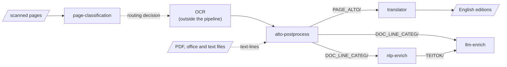

# ATRIUM — UFAL documentation

The tools the Institute of Formal and Applied Linguistics (ÚFAL, Charles University) builds for
**ATRIUM**, and how they fit together: a pipeline that takes scanned archival pages — typewritten
reports, handwritten field notes, photographs, drawings — and turns them into structured,
searchable, linguistically enriched records.

## What ATRIUM is

**ATRIUM** — *Advancing fronTier Research In the arts and hUManities* — is an EU project that
bridges four European research infrastructures: **DARIAH** (arts and humanities), **ARIADNE**
(archaeology), **CLARIN** (language technologies) and **OPERAS** (open scholarly communication).
More at [atrium-research.eu](https://atrium-research.eu/), and in the
[project presentation on Zenodo](https://zenodo.org/records/19500212).

This site documents ÚFAL's part: five tool repositories and the hub that holds them
together — six repositories in all.

## The six repositories

-   **[page-classification](tools/page-classification/index.md)**

    ---

    Sorts a scanned page into one of **eleven structural categories** — so a person or a script
    can decide whether it needs OCR, handwriting recognition, table extraction or image handling.

    [Overview](tools/page-classification/index.md) · [Guide](tools/page-classification/guide.md) · [Reference](tools/page-classification/reference.md)

-   **alto-postprocess**

    ---

    Turns OCR output into per-page ALTO, extracted text and a scored table of line quality — the
    point the whole pipeline fans out from. Besides ALTO it reads the other OCR formats (PAGE XML,
    hOCR, ABBYY FineReader XML, DjVuXML, Tesseract TSV, OCR JSON) and PDF, office and text files.

    [Landing page](https://ufal.github.io/atrium-alto-postprocess/) · [Source](https://github.com/ufal/atrium-alto-postprocess)

-   **[translator](tools/translator/index.md)**

    ---

    Translates ALTO pages and AMCR metadata records **in place** — every tag, namespace and
    coordinate preserved; only the text changes.

    [Overview](tools/translator/index.md) · [Guide](tools/translator/guide.md) · [Reference](tools/translator/reference.md)

-   **nlp-enrich**

    ---

    Morphology, syntax and named entities for every text line, and the TEITOK corpus format with
    bounding boxes kept.

    [Landing page](https://ufal.github.io/atrium-nlp-enrich/) · [Source](https://github.com/ufal/atrium-nlp-enrich)

-   **llm-enrich**

    ---

    Keywords and vocabulary mapping against the ATRIUM controlled vocabulary, with local or remote
    LLMs — and the converter for born-digital documents.

    [Landing page](https://ufal.github.io/atrium-llm-enrich/) · [Source](https://github.com/ufal/atrium-llm-enrich)

-   **atrium-project** — the hub

    ---

    The shared code every tool vendors, the CI they all run, the end-to-end tests, and this site.

    [Architecture](ecosystem/architecture.md) · [Repository map](ecosystem/repository-map.md)

## Start here

- **[page-classification](tools/page-classification/index.md)** — sort a scanned page into
  one of 11 structural categories, so you know what to do with it next
- **[translator](tools/translator/index.md)** — translate ALTO and AMCR XML in place, every
  tag and coordinate preserved
- **[Pipelines](pipelines.md)** — what the tools do, end to end: what each stage reads and
  writes, drawn as the file flow and the record flow
- **[External tools & services](external-tools.md)** — the glossary, if a name is unfamiliar
- **[Repository map](ecosystem/repository-map.md)** — which repo owns what

And by question:

| If you want to…                                      | Read                                                                                            |
|------------------------------------------------------|-------------------------------------------------------------------------------------------------|
| know what a record written by these tools looks like | [The document contract](ecosystem/document-contract.md)                                         |
| run a tool as a service, or on Kubernetes            | [Operations](operations.md)                                                                     |
| let a coding agent use a tool                        | [Agent skills](agent-skills.md)                                                                 |
| know what every field and label means                | [Schemas](contracts/schemas.md) · [SKOS & the ATRIUM vocabulary](contracts/skos.md)             |
| publish results to a repository or catalogue         | [RO-Crate export](contracts/rocrate.md)                                                         |
| change shared code, or contribute                    | [Architecture](ecosystem/architecture.md) · [Contributing standards](contributing-standards.md) |

## How the ecosystem works

**Five tools, each a separate repository.** Every tool is a command-line program and an HTTP
service built from the same code, shipped as two container images. The tools need very
different environments — a vision-model stack, CPU heuristics, remote translation services,
GPU language models — so they are not combined into one program.

**One record per document.** What ties the stages together is a JSON record,
`<doc_id>.document.json`, that each stage reads, extends with the one block it owns, and passes
on. By the end it holds the page categories, the text layer, the translation reference, the
entities and the enrichment — and a provenance trail saying which program, at which version and
under which licence, wrote each part. See [The document contract](ecosystem/document-contract.md).

**One hub.** `atrium-project` holds the code every tool shares — the record, the run log, the
licence rules, the vocabulary, the service contract — and hands out byte-identical copies of
it; it runs the CI every tool calls, and the end-to-end test that runs them together. See
[Architecture](ecosystem/architecture.md).

**Built here, run by the partners.** ÚFAL builds, tests and publishes the container images;
the partner institutes of archaeology run them on their own infrastructure, next to their own
collections. See [Operations](operations.md).

## About this site

Every page here is **written**, not generated: it explains how the parts fit together, and ends
with a *Sources* table naming what it was written from. The tools' own `README.md` and
`CONTRIBUTING.md` stay the full-length references; these pages are the map between them.

The site's source is `docs_site/` in the hub. A pull request builds it with
`mkdocs build --strict`, which fails on any broken link or anchor between pages; a merge to `main`
publishes it to the `gh-pages` branch.
