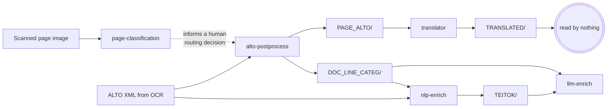
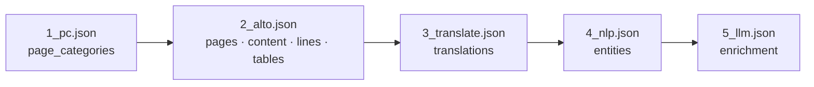

# Pipelines

What the tools do, end to end: what goes in, what each stage does, what comes out, and what
the point of it is.

!!! info "Written so far: W1, W4, W5, W6, W7, W8, W12 and W13"
    Every workflow that runs through **page-classification** or the **translator**, the two
    repositories whose documentation is furthest along. The remaining five belong to the other
    three tools; they are listed at the bottom with a line each and will be written as those
    sections are.

## The correction this page makes

Every existing diagram in this ecosystem draws five boxes with arrows between them. That
picture is wrong in a specific and consequential way: **most of those arrows are not file
handoffs.** Verified against the tree:

* **No repository reads `TRANSLATED/`** — zero hits across all four downstream repositories.
  The translator is a terminal branch.
* **`nlp-enrich` reads `DOC_LINE_CATEG/` and the *original* `ALTO/`**, never the
  translator's output.
* **`alto-postprocess` never consumes `page_categories`.** Its only occurrences of that key
  are in the vendored schema files — deep-copy pass-through. The page classifier informs a
  **human routing decision**; it does not trigger the next stage.

The genuine file handoffs are exactly three: `PAGE_ALTO/` (alto → translator),
`DOC_LINE_CATEG/` (alto → nlp, alto → llm) and `TEITOK/` (nlp → llm).

What *is* linear is the **record**. So this page draws two layers.

### Layer 1 — the file DAG

It fans out from `alto-postprocess` and terminates at the translator.



### Layer 2 — the record accretion chain

Each stage takes `--document-json` in, writes **only the block it owns**, deep-copies
everything else, and stamps `assembled.blocks[<block>]` with its `program`, `run_id` and
`paradata_ref`. Licences are merged through `para_licenses`, so the record carries the
resolved licence of the whole chain rather than of the last writer.



Who may write what is declared once, in the hub-canonical `BLOCK_OWNERS`:

| Block                                 | Owner                                                                   |
|---------------------------------------|-------------------------------------------------------------------------|
| `pages`, `content`, `lines`, `tables` | `alto-postprocess` **or** `digital-convert`, decided by `source.origin` |
| `page_categories`                     | `page-classification`                                                   |
| `translations`                        | `translator`                                                            |
| `entities`                            | `nlp-enrich`                                                            |
| `enrichment`, `forms`                 | `llm-enrich`                                                            |

That table authorises **writes**. The read-time answer to "who wrote this block in *this*
record" is `assembled.blocks[<block>].program`, and for a field-split block
`provenance.contributors[]` — the stamp names only the most recent writer.

## The workflows

### W1 — Scanned / OCR document pipeline

**Purpose.** Take a scanned archival page and end with a searchable, enriched, FAIR record
of the document it belongs to.

**Inputs.** A page image, and — for every stage after the first — the ALTO XML produced by
OCR.

**Stages.**

| # | Stage                                                     | Reads                                    | Writes                          | Block                                 |
|---|-----------------------------------------------------------|------------------------------------------|---------------------------------|---------------------------------------|
| 1 | [page-classification](tools/page-classification/index.md) | the page image                           | a Top-N CSV                     | `page_categories`                     |
| 2 | alto-postprocess                                          | `ALTO/`                                  | `PAGE_ALTO/`, `DOC_LINE_CATEG/` | `pages`, `content`, `lines`, `tables` |
| 3 | [translator](tools/translator/index.md)                   | `PAGE_ALTO/<doc>/<doc>-N.alto.xml`       | `TRANSLATED/`                   | `translations`                        |
| 4 | nlp-enrich                                                | `DOC_LINE_CATEG/` + the original `ALTO/` | `TEITOK/`                       | `entities`                            |
| 5 | llm-enrich                                                | `DOC_LINE_CATEG/`, `TEITOK/`             | enrichment output               | `enrichment`                          |

**Outputs.** The translated document, the TEITOK XML, and one `atrium_document` record that
has accreted every stage's block — which `atrium_rocrate.py` can then map, granularity
intact, into an RO-Crate.

**What the user actually gets.** A routing decision for each page (stage 1), a cleaned
positional text layer with per-line quality scores (stage 2), an English reading of the
document (stage 3), linguistic annotation and named entities (stage 4), and
vocabulary-linked enrichment (stage 5) — with a provenance record that says which program,
at which version, produced each of them.

!!! warning "There is no way to run this as one command"
    `atrium-project/compose/docker-compose.pipeline.yml` **does not exist**. No
    cross-service orchestration exists anywhere in the ecosystem. The only working
    end-to-end definition is the CI workflow described in [W6](#w6--e2e-smoke-the-integration-contract),
    and the practical answer to "how do I run the whole pipeline?" is to copy its `docker run`
    invocations. The two this round covers are reproduced in
    [page-classification → Guide](tools/page-classification/guide.md#4--run-it-as-one-stage-of-the-pipeline)
    and [translator → Guide](tools/translator/guide.md#5--run-it-as-one-stage-of-the-pipeline).

### W4 — Containerised service / API workflow

**Purpose.** Use a tool without installing it, over HTTP, one document at a time — the mode
a web frontend, an Agent Skill or another service uses.

**Inputs.** One file per request, uploaded as multipart, optionally with a baseline
`document_json` to accrete onto.

**Stages.** Every one of the five tools publishes an `atrium-<tool>-api` image from the same
Dockerfile as its batch image, and every one exposes the same meta-contract:

| Endpoint                | Guarantee                                                                               |
|-------------------------|-----------------------------------------------------------------------------------------|
| `GET /info`             | `service`, `version`, `endpoints` (the live route set), `limits` — plus per-tool extras |
| `GET /health`           | 200 while the process is alive                                                          |
| `GET /health?deep=true` | 503 with detail when a dependency is degraded, or when draining                         |
| `GET /ready`            | 503 `starting` → 200 `ready` → 503 `draining` on SIGTERM                                |

The tool-specific endpoints for the two repositories documented here:

| Tool                | Endpoints                                       | Upload cap                                                                       |
|---------------------|-------------------------------------------------|----------------------------------------------------------------------------------|
| page-classification | `POST /predict_image`, `POST /predict_document` | 10 MB, 50 PDF pages                                                              |
| translator          | `POST /translate`                               | 50 MB — the highest of the five, because ALTO XML goes in and ALTO XML comes out |

**Outputs.** JSON for the classifier; for the translator, the **document itself** as an XML
attachment, or `multipart/mixed` when a record was supplied. The translator is the one
service that does not answer with a JSON envelope, by design — it composes with `curl -o`.

**What the user actually gets.** A stateless, horizontally scalable stage: nothing is
retained between requests, so a Kubernetes `Deployment` can scale on queue depth. Error
codes are harmonised across all five services (`413`, `415`/`400`, `422`, `500`, `503`), so
a client can treat them uniformly — with the one caveat that FastAPI's `detail` is a string
for a service-raised error and a list of validation objects when FastAPI rejects the request
first.

A clean shutdown exits **143** (128 + SIGTERM) after draining for `GRACEFUL_SHUTDOWN_S`.
That is success, not failure.

See [Operations](operations.md) for deployment, and [Agent skills](agent-skills.md) for the
clients that sit on top of these endpoints.

### W5 — Agent-Skill workflow

**Purpose.** Let an AI agent use a tool the way a person uses a web service — find it, ask what
it offers, send a file, read the answer — without importing the tool's code or installing its
dependencies.

**Inputs.** Files on the agent's side — page images or PDFs for the classifier, ALTO pages or
AMCR records for the translator — and a service to send them to: a local one, or a hosted one
named by a single environment variable.

**Stages.** Each `agent-skill` branch ships a `SKILL.md` and a standard-library-only client;
the agent follows the same five steps with either tool.

| # | Stage              | page-classification                                                                            | translator                                                                                                           |
|---|--------------------|------------------------------------------------------------------------------------------------|----------------------------------------------------------------------------------------------------------------------|
| 1 | Find a service     | `$ATRIUM_PC_URL`, else a local one started with `scripts/server.sh`                            | `$ATRIUM_TR_URL`, else a local one started with `scripts/server.sh`                                                  |
| 2 | Ask what it offers | `atrium_classify.py --info` — models, categories, limits                                       | `atrium_translate.py --info` — capabilities and limits                                                               |
| 3 | Send the file      | `/predict_image` or `/predict_document`, by suffix; the client checks 10 MB and 50 pages first | `/translate`, `.xml` only; the client checks 50 MB first                                                             |
| 4 | Read the answer    | `FILE, PAGE, RANK, LABEL, SCORE` as a table, CSV or JSON                                       | the translated file (`page.alto.xml` → `page_en.alto.xml`), plus the updated record when a baseline was sent with it |
| 5 | Decide what next   | the exit code                                                                                  | the exit code                                                                                                        |

**Outputs.** Whatever the service returns, saved or printed by the client — and an exit code
that is the agent's whole decision table: `0` done; `1` a file not found or nothing produced;
`2` nothing listening, so start the server and retry once; `3` an HTTP error after three
attempts ten seconds apart, so read `/health?deep=true` and the logs.

**What the user actually gets.** The same instructions work against a laptop and against a
hosted endpoint: switching is one variable, so when the services are hosted no skill has to
change. The agent never holds a model or a GPU — the classifier's weights live in the service
container, and the translator's model runs at LINDAT.

!!! warning "page-classification's `server.sh` does not start the API through Docker"
    Its default path starts the batch service rather than the `api` profile, so stage 1 times
    out. Until it is fixed, start the service by hand — `docker compose --profile api up -d api`
    — or point `ATRIUM_PC_URL` at a running one. The translator's script works. Details in
    [Agent skills → Known drift](agent-skills.md#known-drift).

### W6 — E2E smoke: the integration contract

**Purpose.** Prove that the five tools still compose. This is the only place the whole chain
runs, and it is therefore the de-facto specification of the pipeline.

**Inputs.** One synthetic single-page Czech document, `CTX000000003` — ALTO v3,
`LANG="cs"`, one page, two lines. There is **no committed page image**: the
page-classification stage renders one from the ALTO at run time, keeping the whole smoke
test anchored to a single fixture.

**Stages.** Five `docker run` invocations, each mounting one shared workspace and threading
the record forward: `1_pc.json` → `2_alto.json` → `3_translate.json` → `4_nlp.json` →
`5_llm.json`. Triggered on push to `main`, on dispatch, and on a cron every third day.

**The `DOC_LINE_CATEG` bridge.** The E2E config sets `SKIP_CLASSIFY = true` for
alto-postprocess, and the hub commits that stage's real output as a fixture instead —
`DOC_LINE_CATEG/CTX000000003.csv`, in alto HEAD's 37-column `CSV_HEADER` format, one
`Clear` line and one `Non-text` line.

The reason is hardware: alto-postprocess's line-categorisation step (`langID_classify.py`)
**hard-requires CUDA**, and GitHub-hosted runners have no GPU. Skipping the stage and
committing its output is what lets the remaining four stages be exercised at all — stages 4
and 5 read the bridge file directly. It is a *pinned* fixture, unlike the vocabulary, because
the assertions depend on its content.

*(This explanation is reconstructed here: `fixtures/e2e/README.md` is truncated mid-sentence
at exactly this point, after the words "`langID_classify.py` hard-requires CUDA".)*

**What a green run does and does not prove.**

!!! warning "A green E2E does not describe one coherent artifact"
    Each stage runs a **published image** selected by the `image-tag` input, but mounts
    **source checked out with no `ref:`** — that is, each tool repository's *default
    branch*, not the branch or tag the image was built from. Only the hub checkout is
    pinned, at `@v1`.

    So read a green run as: *default-branch source is compatible with that image tag*. Read
    the two together, or the claim is stronger than the evidence. Coupling `ref:` to
    `image-tag` is filed separately, because it changes what the gate means rather than
    correcting a document.

Assertions check **formats and contracts, never model quality**. Every job boundary in the
workflow is one cross-repository interface, which is the point.

### W7 — Vocabulary harvesting & review (the translator's half)

**Purpose.** Make domain terms translate the same way every time. An archaeological term such as
*(polo)zemnice* has one agreed English rendering, *pit house*; a general translation model does
not know that, and may render it differently in every document. W7 builds the list of agreed
pairs and enforces it at translation time.

**Inputs.** Two public vocabularies, both served from `aiscr.cz`: the AMCR *heslář* — the
controlled keyword lists of the Archaeological Map of the Czech Republic — over OAI-PMH, and the
TEATER thesaurus over GraphQL. No credentials.

**Stages.** `load_vocab.py` does 1–3 once; the translator does 4–6 on every run given
`--vocabulary`.

| # | Stage           | What actually happens                                                                                                                                                                                                                                                                                                                                                                                                        |
|---|-----------------|------------------------------------------------------------------------------------------------------------------------------------------------------------------------------------------------------------------------------------------------------------------------------------------------------------------------------------------------------------------------------------------------------------------------------|
| 1 | Harvest AMCR    | `ListRecords` with `metadataPrefix=oai_amcr&set=heslo` against `https://api.aiscr.cz/2.2/oai`, following resumption tokens and sleeping `--delay` (0.3 s) between pages. Each `heslo` block gives its Czech term and its `heslo_en` sibling when both are non-empty. A network or XML error ends the harvest and **keeps what was collected so far**                                                                         |
| 2 | Harvest TEATER  | Introspect the schema at `https://teater.aiscr.cz/api/graphql`. If an `exportAll` query exists its export is downloaded — and **discarded**: the parser is a stub that returns nothing (`load_vocab.py:270-275`). The terms come from the fallback, `search(value: "", limit: 99999)` once in Czech and once in English, joined on `id`. Nothing throttles this side                                                         |
| 3 | Merge and write | TEATER first, then AMCR over it, so **AMCR wins** a collision. Keys are lower-cased and rows sorted, so a re-harvest gives a stable diff. Five columns: `source_lemma, target_translation, source, source_id, uri`. Nothing harvested → exit `2`, and the existing file is left alone; `--skip-amcr` together with `--skip-teater` is refused as a usage error                                                               |
| 4 | Load            | `processors/vocab.py` reads the 2-column form or the 5-column one, with or without a header row. A later duplicate key wins. An unreadable file prints a warning and loads **nothing** — the run carries on without a vocabulary                                                                                                                                                                                             |
| 5 | Tag and protect | Before each translation call: multi-word phrases, longest first, case-insensitive — **only the first occurrence of each** (`count=1`, and no word boundary is required); then single words by UDPipe lemma, **skipping plural tokens** so the model can inflect the English. Each match becomes an `Xtermzzz<N>z` sentinel; after translation it is restored — exact, then case-insensitive, then fuzzy — as the agreed term |
| 6 | Account         | Paradata records `vocabulary_protected_terms` per document plus a total, and the run's licence gains `udpipe2_engine`, `udpipe2_models`, `amcr_vocab` and `teater_data`                                                                                                                                                                                                                                                      |

**Outputs.** `data_samples/vocabulary.csv` (the default `--out`), and translated documents in
which every protected term carries its agreed rendering.

**What the user actually gets.** From the two runs committed with the repository (2026-06-08):
113 terms protected across 16 AMCR records, and 869 in a single ALTO document. Both runs resolve
to **CC BY-NC-SA 4.0**, determined by CUBBITT and the UDPipe models — loading the vocabulary adds
two CC BY-NC 4.0 sources, but a CUBBITT run was already the more restrictive licence.

**Where the documentation and the tree disagree.**

* The committed `vocabulary.csv` is the **older 2-column file** — 5,087 rows, no source, id or
  URI. Re-running `load_vocab.py` today writes the 5-column form. Both load.
* The README's AMCR endpoint omits `verb` and `metadataPrefix`, and its "`exportAll`, or a
  `search`-based fallback" is in practice `search` only.
* `load_vocab.py`'s own docstring still calls it `download_vocabularies.py`.

**The review half** belongs to nlp-enrich, which builds the reviewed SKOS vocabulary from the same
two sources with its own harvester. The files are prefix-compatible by design — these five columns
are the first five of nlp-enrich's `*_flat.csv` (`load_vocab.py:51-55`) — but they are two
harvests, and they differ. See
[SKOS → The translator and its glossary](contracts/skos.md#the-translator-and-its-glossary).

### W8 — Training and evaluation (page-classification)

**Purpose.** Fine-tune, cross-validate and score a page classifier — the only workflow in the
ecosystem that produces a model rather than consuming one.

**Inputs.** A directory tree of page images, one folder per category (the label list is
derived from `sorted(os.listdir())` at run time, which is why the document schema
deliberately carries no `enum` for this field). Optionally an explicit folds CSV.

**Stages.**

1. **Split** — deterministic periodic sampling with a randomised offset, not a shuffle;
   80/10/10, or read from `--folds_csv` to reproduce a model's original split exactly, with
   pages absent from the CSV excluded.
2. **Train** — `--train`, three epochs at 5e-5, batch 8, `load_best_model_at_end` on
   accuracy. Augmentation is colour jitter, sharpness and Gaussian blur at 50 % each, and
   deliberately **no rotation or flipping**: page orientation is part of what is being read.
3. **Evaluate** — `--eval` produces a Top-N CSV with a `TRUE` column, a raw per-class CSV and
   a confusion-matrix plot at 300 dpi.
4. **Average** — `--average -ap <pattern>` averages fold weights; `--best` averages the five
   published models' *probabilities* at inference time. These are different operations.

**Outputs.** Model weights, `{stamp}_{rev}_FOLD_{n}_DATASETS.txt` recording the split
actually used, evaluation CSVs, confusion matrices, and paradata whose resolved licence is
**CC BY-NC 4.0** rather than MIT — because training logs the LINDAT dataset, which
`setup/para_config.txt` declares as CC BY-NC 4.0. (The README says a training run resolves to
CC BY-NC-SA 4.0; the resolver follows `para_config.txt`.)

**What the user actually gets.** A reproducible model. The fold rule
`splitN ↔ foldN ↔ seed 420+(N−1)` and `REVISION_BEST_FOLDS` mean a published revision can be
retrained on the split it originally saw, which is what made the licensed-subset retraining
measurable at all: `v*.4` differed from `v*.3` on 24 of 229 samples, all of them already
ambiguous.

Full flag reference: [page-classification → Reference](tools/page-classification/reference.md#training-and-evaluation).

### W12 — Annotation round trip (page-classification's half)

**Purpose.** Turn a pile of PDFs into a labelled training set, and feed what a reviewer finds back
into it. Every page-classification model was trained on a set built this way.

**Inputs.** PDFs, and a person with a spreadsheet. No annotation tool is named or shipped — labels
are typed into a CSV.

**The one fact to hold on to: folder names are the labels.** Training and evaluation read a
directory tree with one folder per category, and take the category list from
`sorted(os.listdir())` — whatever is in that directory, files included (`utils.py:196`). A
mistyped folder name is a new class; a stray file stops the run.

**Stages.** The scripts live in `data_scripts/unix/` (`.sh`) and `data_scripts/windows/` (`.bat`),
with the same flags in both, and in `supplementary/scripts/`.

| # | Stage                    | Script                                       | What actually happens                                                                                                                                                                                                                                                                   |
|---|--------------------------|----------------------------------------------|-----------------------------------------------------------------------------------------------------------------------------------------------------------------------------------------------------------------------------------------------------------------------------------------|
| 1 | PDF → page images        | `pdf2png.sh` · `pdf2png.bat`                 | Unix: `pdftoppm`, one job per core, 300 dpi PNG by default, page numbers zero-padded (`doc-001.png`). **Each PDF is deleted once converted unless `-k` is given**, and only lower-case `*.pdf` is found. Windows: ImageMagick + Ghostscript, one file at a time, unpadded (`doc-1.png`) |
| 2 | Gather one-pagers        | `move_single.sh` · `.bat` *(optional)*       | Every folder holding exactly one image is emptied into `./onepagers/` and removed; `-n` previews it. The default target is relative to *where you run it*, while `sort.sh` looks for `onepagers/` *inside its input directory* — run it from there, or pass `-t`                        |
| 3 | Annotate                 | a spreadsheet                                | A CSV of exactly three columns, `FILE,PAGE,CLASS`, one row per page, `PAGE` **not** zero-padded. The README suggests keeping the categories roughly equal in size                                                                                                                       |
| 4 | Route into label folders | `sort.sh` · `sort.bat`                       | Each row's page is copied — or `--move`d — into `<out>/<CLASS>/`, trying no padding, then 2-, 3- and 4-digit padding, then `onepagers/`. `sort.sh --dry-run` previews it; `sort.bat` has no dry run                                                                                     |
| 5 | Train and evaluate       | `run.py --train` · `--eval`                  | [W8](#w8--training-and-evaluation-page-classification). `--folds_csv` fixes the split: it needs a `PNG` column holding the exact file name and `foldN` columns of `train` / `dev` / `test`; pages missing from it are left out                                                          |
| 6 | Review                   | the `--raw` and EVAL tables                  | Raw tables are sorted by per-class probability, so the ambiguous pages gather where a reviewer looks; EVAL tables carry a `TRUE` column beside the prediction                                                                                                                           |
| 7 | Correct                  | a file manager                               | Mislabelled pages are moved between label folders — the tree is the source of truth, not the CSV                                                                                                                                                                                        |
| 8 | Re-sync the CSV          | `filtering.py`                               | Keeps only the rows whose `(file, page, class)` still exists in the tree, written to `<stem>_filtered.csv` beside the input                                                                                                                                                             |
| 9 | Account for the split    | `result/stats/unused.sh` · `dataset_stat.sh` | Which annotated pages no fold used, and per-set, per-category counts, read from the `*_FOLD_*_DATASETS.txt` split records                                                                                                                                                               |

**What the loop does not do for you.** Each of these was run, on copies, in a scratch directory:

* **`sort.sh` reads the CSV by position.** Only the first two commas split a row; everything after
  the second is the class. A CSV with more columns — one that also carries a document title and a
  DOI, say — produces a label folder named `TEXT,Doc A,10.60585`, and the `/` in the DOI nests a
  second folder inside it. Cut the CSV to three columns first.
* **A row whose page is missing still creates its label folder**, empty: `sort.sh` makes the folder
  before it looks for the file, and an empty folder is still a category to training.
* **A zero-padded `PAGE` fails.** `08` is rejected as an invalid octal number and the page is
  reported not found. The `onepagers/` fallback tries the unpadded name only.
* **`filtering.py` does not accept the annotation CSV.** It requires `FILE, PAGE, CLASS-1` — the
  column names of the classifier's *output* — and exits on a `FILE,PAGE,CLASS` file. And a page
  moved to another folder has its row **dropped, not relabelled**: after a correction pass the CSV
  loses the corrected pages rather than recording their new labels.
* **The shipped sample tree cannot be trained on as configured.** `setup/config.txt` points
  `[TRAIN]` and `[EVAL]` at `./small_data_samples`, which holds a `LICENSE` file beside its eleven
  label folders; `collect_images()` lists it as a twelfth category and stops with
  `NotADirectoryError`. The function's docstring describes exactly this, and leaves the fix — keep
  directories only — to a separate, behaviour-changing change. `skos_strategy.md` records that fix
  as done; at `8c98a3d` it is not. See
  [SKOS → What page-classification actually does with it](contracts/skos.md#what-page-classification-actually-does-with-it).

**Helpers around the loop.** `averaging.py` averages several result tables — only pages present in
every input survive, and a wide per-model table counts one vote per model, which makes it a
majority vote; `per_doc_split.py` splits a result table into one CSV per document;
`result_analysis.sh` scores a directory of `*_EVAL.csv` files; `downscale.py` resizes a label tree.

**Where the README's instructions fail as written.**

| The README says                                                | What works                                                                                  |
|----------------------------------------------------------------|---------------------------------------------------------------------------------------------|
| `supplement_scripts/…`                                         | `supplementary/scripts/…`                                                                   |
| `data_scripts/pdf2png.sh`, `data_scripts/move_single.sh`       | `data_scripts/unix/…` or `data_scripts/windows/…`                                           |
| `downscale.py -i train_dir -o small_train_dir --scale 50`      | `--src` / `--dst`; `-i` is an argparse error                                                |
| `result_analysis.sh -d result/tables/`                         | the directory is positional; `-d` is "Unknown option"                                       |
| `filtering.py -i annotations.csv -d train_dir` cleans your CSV | it needs `CLASS-1`, not `CLASS`, and writes `annotations_filtered.csv` rather than in place |
| `logs_stats.py`                                                | `logs_stat.py`                                                                              |
| "use `--dry-run`" for sorting                                  | `sort.sh` only                                                                              |

`pdf2png.bat`'s header also points at a `pdf2png.ps1` that does not exist.

**Outputs.** A label tree ready for W8, a CSV that agrees with it, and split records that say which
page was used where.

**What the user actually gets.** The published training dataset — 48,499 page images from 37,328
documents, cited as `hdl.handle.net/20.500.12800/1-6184` — is this loop's output. The `v*.4`
generation is the one round trip that has been measured: the set was reduced for licensing, the
five models were retrained on the same folds, and predictions moved on 24 of 229 samples, all of
them already ambiguous ([W8](#w8--training-and-evaluation-page-classification)).

### W13 — RO-Crate export / FAIR publication

**Purpose.** Hand a finished record to a repository or catalogue in a form it can read without
knowing anything about ATRIUM.

**Inputs.** Records that have already been through the pipeline and, for a run crate, the run's
paradata file.

**Stages.** One, run by hand. The exporter is vendored into both tools and neither calls it:

```bash
python atrium_rocrate.py --document CTX000000003.document.json --out-dir crate/
python atrium_rocrate.py --run 1.document.json 2.document.json --paradata run.json --out-dir crate/
```

**Outputs.** `ro-crate-metadata.json` — RO-Crate 1.1, sorted and byte-stable, written atomically.
A run crate holds one sub-crate per document and also declares the Process Run Crate profile.

**What the user actually gets.** A catalogue-readable description with a separate creator and date
for every block, so "who classified the pages" and "who translated them" have separate answers.
What does not survive: which page carries which category, the classifier's confidences, and the
translation's language pair and backend. The record's licence carries through as it is, defect
included. And the FAIR half is not there yet — no persistent identifier, no checksums on outputs,
no commit SHA. The full mapping is under
[RO-Crate export → What happens to these two tools' blocks](contracts/rocrate.md#what-happens-to-these-two-tools-blocks),
the gaps under [What a crate cannot yet say](contracts/rocrate.md#what-a-crate-cannot-yet-say).

## The remaining five

Listed so the map is complete. Each will be written as its tool's section lands.

| #   | Workflow                               | What it is                                                                                                                                                                                  |
|-----|----------------------------------------|---------------------------------------------------------------------------------------------------------------------------------------------------------------------------------------------|
| W2  | Born-digital pipeline                  | Two stages, not six — a digital-born PDF or DOCX already has a text layer, so `digital-convert` originates the positional plane directly and origin-consistency refuses a second originator |
| W3  | Digital → OCR re-origination           | How a digital-born document that turns out to need OCR is re-authorised, through `needs_ocr: true` — the single exception that lets two originators coexist                                 |
| W9  | Parameter optimisation / rule coverage | alto-postprocess's sweep over its categorisation rules                                                                                                                                      |
| W10 | Document-understanding benchmark       | llm-enrich's stratified sampling and model comparison                                                                                                                                       |
| W11 | Format adaptation via flexiconv        | Converting between ALTO, PAGE XML, hOCR and friends at the edges of the pipeline                                                                                                            |

## Sources

Written from the tree at the refs below. This table records **provenance**, not a build
instruction.

| Source                                                                                                                                                                                                                          | What was taken from it                                                                                            |
|---------------------------------------------------------------------------------------------------------------------------------------------------------------------------------------------------------------------------------|-------------------------------------------------------------------------------------------------------------------|
| `atrium-project/.github/workflows/e2e-pipeline-smoke.yml`                                                                                                                                                                       | W1's stage table, W6 in full, the published-image-vs-default-branch caveat, `SKIP_CLASSIFY = true`                |
| `atrium-project/fixtures/e2e/README.md`                                                                                                                                                                                         | the fixture description; the bridge explanation is **reconstructed**, because that file is truncated mid-sentence |
| `atrium-project/docs/templates/shared/atrium_document.py:108-118`                                                                                                                                                               | `BLOCK_OWNERS`                                                                                                    |
| `atrium-project/docs/document_schema.md:125-145`                                                                                                                                                                                | the write/read contract and the accretion rules                                                                   |
| `atrium-project/docs/skills_catalog.md`, `docs/k8s_deployment.md`                                                                                                                                                               | W4's endpoint and limit tables                                                                                    |
| `atrium-page-classification` @ `vit` `8415ce7` — `run.py`, `setup/config.txt`, `model_registry.py`                                                                                                                              | W8                                                                                                                |
| `atrium-translator` @ `master` `88242fe` — `main.py`, `service/api.py`, `service/README.md`                                                                                                                                     | W1 stage 3, W4                                                                                                    |
| `atrium-page-classification` @ `vit` `8c98a3d` — `data_scripts/{unix,windows}/*`, `supplementary/scripts/*`, `result/stats/*.sh`, `utils.py`, `classifier.py`, `setup/{config,para_config}.txt`, `README.md` § Data preparation | W12, and the W8 licence correction; every "run" claim executed on copies in a scratch directory                   |
| `atrium-translator` @ `master` `88242fe` — `load_vocab.py`, `processors/{vocab,translator,lemmatizer}.py`, `data_samples/vocabulary.csv`, `data_samples/translated_files/paradata/*.json`                                       | W7                                                                                                                |
| both tools' `agent-skill` branches (pc `c689a06`, translator `1857b3b`)                                                                                                                                                         | W5                                                                                                                |
| `atrium-project/docs/templates/shared/atrium_rocrate.py`                                                                                                                                                                        | W13                                                                                                               |
