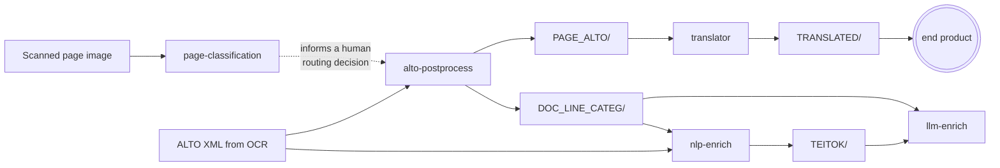
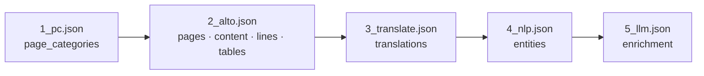

# Pipelines

What the tools do, end to end: what goes in, what each stage does, what comes out, and what
the point of it is.

!!! info "Scope"
    Every workflow that runs through **page-classification** or the **translator** is
    described in full. The five that belong only to alto-postprocess, nlp-enrich and
    llm-enrich are listed under [Other workflows](#other-workflows).

**The workflows at a glance:**

| #   | Workflow                                                                         | In one line                                                                                                  |
|-----|----------------------------------------------------------------------------------|--------------------------------------------------------------------------------------------------------------|
| W1  | [Scanned / OCR document pipeline](#w1--scanned--ocr-document-pipeline)           | a scanned page in, a searchable, enriched, documented record out                                             |
| W2  | Born-digital pipeline                                                            | the same, for PDFs and DOCX files that already have a text layer                                             |
| W3  | Digital → OCR re-origination                                                     | handing a born-digital document back to OCR when its text layer is unusable                                  |
| W4  | [Containerised service / API](#w4--containerised-service--api-workflow)          | any tool, over HTTP, one document per request                                                                |
| W5  | [Agent Skill](#w5--agent-skill-workflow)                                         | a coding agent using a tool through its service                                                              |
| W6  | [E2E smoke](#w6--e2e-smoke-the-integration-contract)                             | the automated test that runs the whole chain                                                                 |
| W7  | [Vocabulary harvesting](#w7--vocabulary-harvesting--review-the-translators-half) | building the term list that keeps translations consistent                                                    |
| W8  | [Training and evaluation](#w8--training-and-evaluation-page-classification)      | making and scoring a page-classification model                                                               |
| W9  | Parameter optimisation                                                           | tuning alto-postprocess's line-categorisation rules                                                          |
| W10 | Document-understanding benchmark                                                 | comparing models on sampled documents                                                                        |
| W11 | Format adaptation                                                                | bringing PDF, office files, PAGE XML, hOCR, … in: as line tables (alto-postprocess) or as TEITOK (flexiconv) |
| W12 | [Annotation round trip](#w12--annotation-round-trip-page-classifications-half)   | turning PDFs into a labelled training set, and corrections back into it                                      |
| W13 | [RO-Crate export](#w13--ro-crate-export--fair-publication)                       | packaging finished records for a repository or catalogue                                                     |

## How the stages connect

A pipeline diagram with five boxes in a row suggests five file handoffs. The files actually
move differently:

* **page-classification informs a routing decision.** Its categories tell a person or a
  script which pages go to OCR, HTR, table or image extraction; the next stage,
  alto-postprocess, works from the OCR output and does not read `page_categories`.
* **alto-postprocess is where the files fan out.** It writes per-page ALTO (`PAGE_ALTO/`) for
  the translator and a per-line table (`DOC_LINE_CATEG/`) for nlp-enrich and llm-enrich.
* **The translator's output is an end product.** `TRANSLATED/` holds English editions for
  readers; no later stage reads it.
* **nlp-enrich reads `DOC_LINE_CATEG/` and the original `ALTO/`**, and writes `TEITOK/`,
  which llm-enrich reads.

So there are three file handoffs — `PAGE_ALTO/`, `DOC_LINE_CATEG/` and `TEITOK/` — and one
thing that does run through every stage in order: the **record**. This page draws both
layers.

### Layer 1 — the file DAG

It fans out from `alto-postprocess` and terminates at the translator.



### Layer 2 — the record accretion chain

Each stage takes `--document-json` in, writes **only the block it owns**, deep-copies
everything else, and stamps `assembled.blocks[<block>]` with its `program`, `run_id` and
`paradata_ref`. Licences are merged through `para_licenses`, so the record carries the
resolved licence of the whole chain rather than of the last writer.



Who may write what is declared once, in the hub-canonical `BLOCK_OWNERS`:

| Block                                 | Owner                                                                   |
|---------------------------------------|-------------------------------------------------------------------------|
| `pages`, `content`, `lines`, `tables` | `alto-postprocess` **or** `digital-convert`, decided by `source.origin` |
| `page_categories`                     | `page-classification`                                                   |
| `translations`                        | `translator`                                                            |
| `entities`                            | `nlp-enrich`                                                            |
| `enrichment`, `forms`                 | `llm-enrich`                                                            |

That table authorises **writes**. The read-time answer to "who wrote this block in *this*
record" is `assembled.blocks[<block>].program`, and for a field-split block
`provenance.contributors[]` — the stamp names only the most recent writer.

## The workflows

### W1 — Scanned / OCR document pipeline

**Purpose.** Take a scanned archival page and end with a searchable, enriched, FAIR record
of the document it belongs to.

**Inputs.** A page image, and — for every stage after the first — the ALTO XML produced by
OCR.

**Stages.**

| # | Stage                                                     | Reads                                    | Writes                          | Block                                 |
|---|-----------------------------------------------------------|------------------------------------------|---------------------------------|---------------------------------------|
| 1 | [page-classification](tools/page-classification/index.md) | the page image                           | a Top-N CSV                     | `page_categories`                     |
| 2 | alto-postprocess                                          | `ALTO/`                                  | `PAGE_ALTO/`, `DOC_LINE_CATEG/` | `pages`, `content`, `lines`, `tables` |
| 3 | [translator](tools/translator/index.md)                   | `PAGE_ALTO/<doc>/<doc>-N.alto.xml`       | `TRANSLATED/`                   | `translations`                        |
| 4 | nlp-enrich                                                | `DOC_LINE_CATEG/` + the original `ALTO/` | `TEITOK/`                       | `entities`                            |
| 5 | llm-enrich                                                | `DOC_LINE_CATEG/`, `TEITOK/`             | enrichment output               | `enrichment`                          |

alto-postprocess also takes OCR output that is not ALTO — PAGE XML, hOCR, ABBYY FineReader XML,
DjVuXML, Tesseract TSV, OCR JSON, a PDF's OCR layer — through its text-lines and json-keys
methods ([W11](#other-workflows)). Those give the same `DOC_LINE_CATEG/` table, but no
`PAGE_ALTO/` for the translator and no page layout for nlp-enrich's TEITOK, which takes its
boxes from the ALTO file (or from a flexiconv conversion). Its ALTO methods split ALTO v3 files
only; v2 and v4 go through text-lines. The formats, their standards and what is kept of each are
in alto-postprocess's
[input formats reference](https://github.com/ufal/atrium-alto-postprocess/blob/master/docs/text_inputs.md).

**Outputs.** The translated document, the TEITOK XML, and one `atrium_document` record that
has accreted every stage's block — which `atrium_rocrate.py` can then map, granularity
intact, into an RO-Crate.

**What the user actually gets.** A routing decision for each page (stage 1), a cleaned
positional text layer with per-line quality scores (stage 2), an English reading of the
document (stage 3), linguistic annotation and named entities (stage 4), and
vocabulary-linked enrichment (stage 5) — with a provenance record that says which program,
at which version, produced each of them.

!!! note "Running the whole chain"
    Each stage runs as its own container, and the stages are joined by the files above and
    the record passed with `--document-json` / `--document-json-out`. The
    [E2E workflow (W6)](#w6--e2e-smoke-the-integration-contract) is the reference sequence of
    `docker run` invocations; the two stages documented here are reproduced in
    [page-classification → Guide](tools/page-classification/guide.md#4--run-it-as-one-stage-of-the-pipeline)
    and [translator → Guide](tools/translator/guide.md#5--run-it-as-one-stage-of-the-pipeline).

### W4 — Containerised service / API workflow

**Purpose.** Use a tool without installing it, over HTTP, one document at a time — the mode
a web frontend, an Agent Skill or another service uses.

**Inputs.** One file per request, uploaded as multipart, optionally with a baseline
`document_json` to accrete onto.

**Stages.** Every one of the five tools publishes an `atrium-<tool>-api` image from the same
Dockerfile as its batch image, and every one exposes the same meta-contract:

| Endpoint                | Guarantee                                                                               |
|-------------------------|-----------------------------------------------------------------------------------------|
| `GET /info`             | `service`, `version`, `endpoints` (the live route set), `limits` — plus per-tool extras |
| `GET /health`           | 200 while the process is alive                                                          |
| `GET /health?deep=true` | 503 with detail when a dependency is degraded, or when draining                         |
| `GET /ready`            | 503 `starting` → 200 `ready` → 503 `draining` on SIGTERM                                |

The tool-specific endpoints for the two repositories documented here:

| Tool                | Endpoints                                       | Upload cap                                             |
|---------------------|-------------------------------------------------|--------------------------------------------------------|
| page-classification | `POST /predict_image`, `POST /predict_document` | 10 MB, 50 PDF pages                                    |
| translator          | `POST /translate`                               | 50 MB, because ALTO XML goes in and ALTO XML comes out |

**Outputs.** JSON for the classifier; for the translator, the **document itself** as an XML
attachment, or `multipart/mixed` when a record was supplied. The translator is the one
service that does not answer with a JSON envelope, by design — it composes with `curl -o`.

**What the user actually gets.** A stateless, horizontally scalable stage: nothing is
retained between requests, so a Kubernetes `Deployment` can scale on queue depth. Error
codes are harmonised across all five services — `413` too large, `400` or `415` a wrong
content type, `422` unusable input, `500` a processing failure, `503` warming up or
draining — so a client can treat them uniformly — with the one caveat that FastAPI's `detail` is a string
for a service-raised error and a list of validation objects when FastAPI rejects the request
first.

A clean shutdown exits **143** (128 + SIGTERM) after draining for `GRACEFUL_SHUTDOWN_S`.
That is success, not failure.

See [Operations](operations.md) for deployment, and [Agent skills](agent-skills.md) for the
clients that sit on top of these endpoints.

### W5 — Agent-Skill workflow

**Purpose.** Let an AI agent use a tool the way a person uses a web service — find it, ask what
it offers, send a file, read the answer — without importing the tool's code or installing its
dependencies.

**Inputs.** Files on the agent's side — page images or PDFs for the classifier, ALTO pages or
AMCR records for the translator — and a service to send them to: a local one, or a hosted one
named by a single environment variable.

**Stages.** Each `agent-skill` branch ships a `SKILL.md` and a standard-library-only client;
the agent follows the same five steps with either tool.

| # | Stage              | page-classification                                                                            | translator                                                                                                           |
|---|--------------------|------------------------------------------------------------------------------------------------|----------------------------------------------------------------------------------------------------------------------|
| 1 | Find a service     | `$ATRIUM_PC_URL`, else a local one started with `scripts/server.sh`                            | `$ATRIUM_TR_URL`, else a local one started with `scripts/server.sh`                                                  |
| 2 | Ask what it offers | `atrium_classify.py --info` — models, categories, limits                                       | `atrium_translate.py --info` — capabilities and limits                                                               |
| 3 | Send the file      | `/predict_image` or `/predict_document`, by suffix; the client checks 10 MB and 50 pages first | `/translate`, `.xml` only; the client checks 50 MB first                                                             |
| 4 | Read the answer    | `FILE, PAGE, RANK, LABEL, SCORE` as a table, CSV or JSON                                       | the translated file (`page.alto.xml` → `page_en.alto.xml`), plus the updated record when a baseline was sent with it |
| 5 | Decide what next   | the exit code                                                                                  | the exit code                                                                                                        |

**Outputs.** Whatever the service returns, saved or printed by the client — and an exit code
that is the agent's whole decision table: `0` done; `1` a file not found or nothing produced;
`2` nothing listening, so start the server and retry once; `3` an HTTP error after three
attempts ten seconds apart, so read `/health?deep=true` and the logs.

**What the user actually gets.** The same instructions work against a laptop and against a
hosted endpoint: switching is one variable, so when the services are hosted no skill has to
change. The agent never holds a model or a GPU — the classifier's weights live in the service
container, and the translator's model runs at LINDAT.

### W6 — E2E smoke: the integration contract

**Purpose.** Prove that the five tools still compose. This is the only place the whole chain
runs, and it is therefore the de-facto specification of the pipeline.

**Inputs.** One synthetic single-page Czech document, `CTX000000003` — ALTO v3,
`LANG="cs"`, one page, two lines. There is **no committed page image**: the
page-classification stage renders one from the ALTO at run time, keeping the whole smoke
test anchored to a single fixture.

**Stages.** Five `docker run` invocations, each mounting one shared workspace and threading
the record forward: `1_pc.json` → `2_alto.json` → `3_translate.json` → `4_nlp.json` →
`5_llm.json`. Triggered on push to `main`, on dispatch, and on a cron every third day.

**The `DOC_LINE_CATEG` bridge.** The E2E config sets `SKIP_CLASSIFY = true` for
alto-postprocess, and the hub commits that stage's real output as a fixture instead —
`DOC_LINE_CATEG/CTX000000003.csv`, in alto-postprocess's 37-column `CSV_HEADER` format, one
`Clear` line and one `Non-text` line.

The reason is hardware: alto-postprocess's line-categorisation step (`langID_classify.py`)
**hard-requires CUDA**, and GitHub-hosted runners have no GPU. Skipping the stage and
committing its output is what lets the remaining four stages be exercised at all — stages 4
and 5 read the bridge file directly. It is a *pinned* fixture, unlike the vocabulary, because
the assertions depend on its content.

!!! note "How to read a green run"
    Each stage runs a **published image**, selected by the workflow's `image-tag` input,
    together with files checked out from each tool repository's **default branch**;
    the hub's own files come from its `v1` tag. A green run therefore says that the
    default-branch configuration works with that image tag.

Assertions check **formats and contracts, never model quality**. Every job boundary in the
workflow is one cross-repository interface, which is the point.

### W7 — Vocabulary harvesting & review (the translator's half)

**Purpose.** Make domain terms translate the same way every time. An archaeological term such as
*(polo)zemnice* has one agreed English rendering, *pit house*; a general translation model does
not know that, and may render it differently in every document. W7 builds the list of agreed
pairs and enforces it at translation time.

**Inputs.** Two public vocabularies, both served from `aiscr.cz`: the AMCR *heslář* — the
controlled keyword lists of the Archaeological Map of the Czech Republic — over OAI-PMH, and the
TEATER thesaurus over GraphQL. No credentials.

**Stages.** `load_vocab.py` does 1–3 once; the translator does 4–6 on every run given
`--vocabulary`.

| # | Stage           | What actually happens                                                                                                                                                                                                                                                                                                                                                                                                                                                                                                                                     |
|---|-----------------|-----------------------------------------------------------------------------------------------------------------------------------------------------------------------------------------------------------------------------------------------------------------------------------------------------------------------------------------------------------------------------------------------------------------------------------------------------------------------------------------------------------------------------------------------------------|
| 1 | Harvest AMCR    | `ListRecords` with `metadataPrefix=oai_amcr&set=heslo` against `https://api.aiscr.cz/2.2/oai`, following resumption tokens and sleeping `--delay` (0.3 s) between pages. Each `heslo` block gives its Czech term and its `heslo_en` sibling when both are non-empty. A network or XML error ends the harvest and **keeps what was collected so far**                                                                                                                                                                                                      |
| 2 | Harvest TEATER  | Introspect the schema at `https://teater.aiscr.cz/api/graphql`. `exportAll` returns the export's URL (as the API's internal `http://localhost:8080/api/export`, rewritten to the public host); the download is a JSON `categories` tree, and every concept with a Czech and an English name gives a pair keyed by its TEATER id. A label shared by two concepts keeps the last. Only if that yields nothing does the fallback run: `search(value: "", limit: 99999)` in Czech and in English, joined on `id`. Every TEATER request is spaced by `--delay` |
| 3 | Merge and write | TEATER first, then AMCR over it, so **AMCR wins** a collision. Keys are lower-cased and rows sorted, so a re-harvest gives a stable diff. Five columns: `source_lemma, target_translation, source, source_id, uri`. Nothing harvested → exit `2`, and the existing file is left alone; `--skip-amcr` together with `--skip-teater` is refused as a usage error                                                                                                                                                                                            |
| 4 | Load            | `processors/vocab.py` reads the 2-column form or the 5-column one, with or without a header row. A later duplicate key wins. An unreadable file prints a warning and loads **nothing** — the run carries on without a vocabulary                                                                                                                                                                                                                                                                                                                          |
| 5 | Tag and protect | Before each translation call: multi-word phrases, longest first, case-insensitive, whole words only — **every occurrence** gets its own sentinel; then single words by UDPipe lemma (only for languages with a UDPipe model), **skipping plural tokens** so the model can inflect the English. Each match becomes an `Xtermzzz<N>z` sentinel; after translation it is restored — exact, then case-insensitive, then fuzzy — as the agreed term                                                                                                            |
| 6 | Account         | Paradata records `vocabulary_protected_terms` per document plus a total, and the run's licence gains `udpipe2_engine`, `udpipe2_models`, `amcr_vocab` and `teater_data`                                                                                                                                                                                                                                                                                                                                                                                   |

**Outputs.** `data_samples/vocabulary.csv` (the default `--out`), and translated documents in
which every protected term carries its agreed rendering.

**What the user actually gets.** Consistent terminology across every translated document, with
a count of protected terms per document in the paradata, and a glossary whose every row points
back at the thesaurus concept it came from. A translation run with the vocabulary resolves to
**CC BY-NC-SA 4.0**, determined by CUBBITT and the UDPipe models — the vocabulary adds two
CC BY-NC 4.0 sources, but a CUBBITT run is already the more restrictive licence.

**Worth knowing.** The same Czech label can recur across AMCR's keyword lists, so the number
of pairs is smaller than the number of AMCR records. The glossary is written in the five-column
form; a two-column `source_lemma,target_translation` file loads just as well. Harvest with TLS
verification on — if a certificate chain is incomplete, add the missing intermediate through
`REQUESTS_CA_BUNDLE` rather than disabling verification.

**The review half** belongs to nlp-enrich, which builds the reviewed SKOS vocabulary from the same
two sources with its own harvester. The files are prefix-compatible by design — these five columns
are the first five of nlp-enrich's `*_flat.csv` — but they are separate harvests, each from the
live sources at the time it was run. See
[SKOS → The translator and its glossary](contracts/skos.md#the-translator-and-its-glossary).

### W8 — Training and evaluation (page-classification)

**Purpose.** Fine-tune, cross-validate and score a page classifier — the only workflow in the
ecosystem that produces a model rather than consuming one.

**Inputs.** A directory tree of page images, one folder per category — training reads the
label list from the sorted sub-directory names. Optionally an explicit folds CSV.

**Stages.**

1. **Split** — deterministic periodic sampling with a randomised offset, not a shuffle;
   80/10/10, or read from `--folds_csv` to reproduce a model's original split exactly, with
   pages absent from the CSV excluded.
2. **Train** — `--train`, three epochs at 5e-5, batch 8, `load_best_model_at_end` on
   accuracy. Augmentation is colour jitter, sharpness and Gaussian blur at 50 % each, and
   deliberately **no rotation or flipping**: page orientation is part of what is being read.
3. **Evaluate** — `--eval` produces a Top-N CSV with a `TRUE` column, a raw per-class CSV and
   a confusion-matrix plot at 300 dpi.
4. **Average** — `--average -ap <pattern>` averages fold weights; `--best` averages the five
   published models' *probabilities* at inference time. These are different operations.

**Outputs.** Model weights, `{stamp}_{rev}_FOLD_{n}_DATASETS.txt` recording the split
actually used, evaluation CSVs, confusion matrices, and paradata whose resolved licence is
**CC BY-NC 4.0** rather than MIT — because training logs the LINDAT dataset, which
`setup/para_config.txt` declares as CC BY-NC 4.0.

**What the user actually gets.** A reproducible model. The fold rule
`splitN ↔ foldN ↔ seed 420+(N−1)` and `REVISION_BEST_FOLDS` mean a published revision can be
retrained on the split it originally saw — which is how the `v*.4` generation was trained on
the licensed subset and compared page by page with the generation before it; see
[page-classification → History](tools/page-classification/history.md#2026-06--08--retraining-on-the-licensed-dataset-15).

Full flag reference: [page-classification → Reference](tools/page-classification/reference.md#training-and-evaluation).

### W12 — Annotation round trip (page-classification's half)

**Purpose.** Turn a pile of PDFs into a labelled training set, and feed what a reviewer finds back
into it. Every page-classification model was trained on a set built this way.

**Inputs.** PDFs, and a person with a spreadsheet. No annotation tool is named or shipped — labels
are typed into a CSV.

**The one fact to hold on to: folder names are the labels.** Training and evaluation read a
directory tree with one folder per category, and take the category list from the sorted names of
its sub-directories (`collect_images()` in `utils.py`); files and hidden entries at that level are
ignored. A mistyped folder name is a new class, and an empty folder is one too.

**Stages.** The scripts live in `data_scripts/unix/` (`.sh`) and `data_scripts/windows/` (`.bat`),
with the same flags in both, and in `supplementary/scripts/`.

| # | Stage                    | Script                                       | What actually happens                                                                                                                                                                                                                                                                                                                                                                                                                                              |
|---|--------------------------|----------------------------------------------|--------------------------------------------------------------------------------------------------------------------------------------------------------------------------------------------------------------------------------------------------------------------------------------------------------------------------------------------------------------------------------------------------------------------------------------------------------------------|
| 1 | PDF → page images        | `pdf2png.sh` · `pdf2png.bat`                 | Unix: `pdftoppm`, one job per core, 300 dpi PNG by default, page numbers zero-padded (`doc-001.png`); `.pdf` and `.PDF` are both found. **The PDFs are kept unless `--delete` (`/delete`) is given.** Windows: ImageMagick + Ghostscript, one file at a time, unpadded (`doc-1.png`)                                                                                                                                                                               |
| 2 | Gather one-pagers        | `move_single.sh` · `.bat` *(optional)*       | Every folder holding exactly one image is emptied into `./onepagers/` and removed; `-n` previews it. The default target is relative to *where you run it*, while `sort.sh` looks for `onepagers/` *inside its input directory* — run it from there, or pass `-t`                                                                                                                                                                                                   |
| 3 | Annotate                 | a spreadsheet                                | A CSV with a header row and at least `FILE,PAGE,CLASS`, one row per page. Further columns are ignored, and `PAGE` may be zero-padded (`08`). `sort.sh` finds the columns by header name; `sort.bat` reads the first three by position. The README suggests keeping the categories roughly equal in size                                                                                                                                                            |
| 4 | Route into label folders | `sort.sh` · `sort.bat`                       | Each row's page is copied — or `--move`d — into `<out>/<CLASS>/`, trying no padding, then 2-, 3- and 4-digit padding, in the document's folder or, when it has none, in `onepagers/`. A label folder is made only once a page is found for it; a row whose `PAGE` is not a number or whose `CLASS` is empty or holds `/` or `\` is reported and skipped. `sort.sh` also takes `CLASS-1`/`CATEGORY`, so a result table routes as-is. `--dry-run` (`/n`) previews it |
| 5 | Train and evaluate       | `run.py --train` · `--eval`                  | [W8](#w8--training-and-evaluation-page-classification). `--folds_csv` fixes the split: it needs a `PNG` column holding the exact file name and `foldN` columns of `train` / `dev` / `test`; pages missing from it are left out                                                                                                                                                                                                                                     |
| 6 | Review                   | the `--raw` and EVAL tables                  | Raw tables are sorted by per-class probability, so the ambiguous pages gather where a reviewer looks; EVAL tables carry a `TRUE` column beside the prediction                                                                                                                                                                                                                                                                                                      |
| 7 | Correct                  | a file manager                               | Mislabelled pages are moved between label folders — the tree is the source of truth, not the CSV                                                                                                                                                                                                                                                                                                                                                                   |
| 8 | Re-sync the CSV          | `filtering.py`                               | Keeps each row whose `(file, page, class)` still exists in the tree and **relabels** a row whose page now sits in exactly one other label folder; a page that is gone, or in several other folders, is dropped and reported. Reads `CLASS`, else `CLASS-1`, else `CATEGORY`; writes `<stem>_filtered.csv` beside the input. `--no-relabel` only drops                                                                                                              |
| 9 | Account for the split    | `result/stats/unused.sh` · `dataset_stat.sh` | Which annotated pages no fold used, and per-set, per-category counts, read from the `*_FOLD_*_DATASETS.txt` split records                                                                                                                                                                                                                                                                                                                                          |

**What the loop still leaves to you.** The scripts refuse what would misroute a page — a `PAGE`
that is not a number, a label that is not a single folder name — and report it; they cannot tell a
wrong label from a right one:

* **A mistyped `CLASS` is a new category.** `sort.sh` routes `TEXt` into its own folder, and
  training then counts twelve classes. Check the label list against the eleven in
  [SKOS → How page-classification uses it](contracts/skos.md#how-page-classification-uses-it)
  before sorting; `collect_images()` prints a note when the folders and the declared labels differ.
* **`filtering.py` keys on the `<name>-<page>.png` convention.** A PNG renamed outside it is not
  indexed — the script warns and counts it — so its row is reported as missing.
* **`sort.bat` reads by position**, unlike `sort.sh`: on Windows keep `FILE, PAGE, CLASS` as
  the first three columns.

**Helpers around the loop.** `averaging.py` averages several result tables — only pages present in
every input survive, and a wide per-model table counts one vote per model, which makes it a
majority vote; `per_doc_split.py` splits a result table into one CSV per document;
`result_analysis.sh` scores a directory of `*_EVAL.csv` files; `downscale.py` resizes a label tree.

**Outputs.** A label tree ready for W8, a CSV that agrees with it, and split records that say which
page was used where.

**What the user actually gets.** The published training dataset — 48,499 page images from 37,328
documents, cited as `hdl.handle.net/20.500.12800/1-6184` — is this loop's output. The `v*.4`
generation is one complete round trip: the set was reduced to its licensed subset and the five
models retrained on the same folds ([W8](#w8--training-and-evaluation-page-classification)).

### W13 — RO-Crate export / FAIR publication

**Purpose.** Hand a finished record to a repository or catalogue in a form it can read without
knowing anything about ATRIUM.

**Inputs.** Records that have already been through the pipeline and, for a run crate, the run's
paradata file.

**Stages.** One, run as its own step over finished records. The exporter, `atrium_rocrate.py`, is
vendored into every tool:

```bash
python atrium_rocrate.py --document CTX000000003.document.json --out-dir crate/
python atrium_rocrate.py --run 1.document.json 2.document.json --paradata run.json --out-dir crate/
```

**Outputs.** `ro-crate-metadata.json` — RO-Crate 1.1, sorted and byte-stable, written atomically.
A run crate holds one sub-crate per document and also declares the Process Run Crate profile.

**What the user actually gets.** A catalogue-readable description with a separate creator and date
for every block, so "who classified the pages" and "who translated them" have separate answers,
and the record's computed licence. Per-page detail — which page carries which category, the
language pair of a translation — stays in the record, which can travel inside the crate. The full
mapping is under
[RO-Crate export → What happens to these two tools' blocks](contracts/rocrate.md#what-happens-to-these-two-tools-blocks).

## Other workflows

These run through alto-postprocess, nlp-enrich and llm-enrich only; each tool's own README
describes them.

| #   | Workflow                               | What it is                                                                                                                                                                                                                                                                                                                                                                                                                                                                                                                                                                                                                                                                                                      |
|-----|----------------------------------------|-----------------------------------------------------------------------------------------------------------------------------------------------------------------------------------------------------------------------------------------------------------------------------------------------------------------------------------------------------------------------------------------------------------------------------------------------------------------------------------------------------------------------------------------------------------------------------------------------------------------------------------------------------------------------------------------------------------------|
| W2  | Born-digital pipeline                  | Two stages, not six — a digital-born PDF or DOCX already has a text layer, so `digital-convert` originates the positional plane directly and origin-consistency refuses a second originator                                                                                                                                                                                                                                                                                                                                                                                                                                                                                                                     |
| W3  | Digital → OCR re-origination           | How a digital-born document that turns out to need OCR is re-authorised, through `needs_ocr: true` — the single exception that lets two originators coexist                                                                                                                                                                                                                                                                                                                                                                                                                                                                                                                                                     |
| W9  | Parameter optimisation / rule coverage | alto-postprocess's sweep over its categorisation rules                                                                                                                                                                                                                                                                                                                                                                                                                                                                                                                                                                                                                                                          |
| W10 | Document-understanding benchmark       | llm-enrich's stratified sampling and model comparison                                                                                                                                                                                                                                                                                                                                                                                                                                                                                                                                                                                                                                                           |
| W11 | Format adaptation                      | Two routes for documents that are not ALTO. **alto-postprocess**'s `--method text-lines` reads them directly — PDF text layers, DOCX/ODT/XLSX/PPTX, EPUB, RTF, HTML, the OCR exports PAGE XML, hOCR, ABBYY FineReader XML, DjVuXML and Tesseract TSV, TEI/TEITOK, JSON, CSV, plain text — into the same per-line tables (`DOC_LINE_CATEG/`) nlp-enrich and llm-enrich read, with a truthful `source.origin` per format; it keeps text, not coordinates. **nlp-enrich**'s `api_flexiconv.sh` converts them (PDF, DOCX, PAGE XML, hOCR, …) *into* TEITOK; nlp-enrich then annotates them (`FLEXICONV_ANNOTATE`, or a converted file uploaded to `/enrich`) and llm-enrich reads them. flexiconv never writes ALTO |

## Sources

Written from the tree at the refs below. This table records **provenance**, not a build
instruction.

| Source                                                                                                                                                                                                                                                   | What was taken from it                                        |
|----------------------------------------------------------------------------------------------------------------------------------------------------------------------------------------------------------------------------------------------------------|---------------------------------------------------------------|
| `atrium-project/.github/workflows/e2e-pipeline-smoke.yml`                                                                                                                                                                                                | W1's stage table, W6 in full, `SKIP_CLASSIFY = true`          |
| `atrium-project/fixtures/e2e/README.md`                                                                                                                                                                                                                  | the fixture description                                       |
| `atrium-project/docs/templates/shared/atrium_document.py`                                                                                                                                                                                                | `BLOCK_OWNERS`                                                |
| `atrium-project/docs/document_schema.md`                                                                                                                                                                                                                 | the write/read contract and the accretion rules               |
| `atrium-project/docs/skills_catalog.md`, `docs/k8s_deployment.md`                                                                                                                                                                                        | W4's endpoint and limit tables                                |
| `atrium-page-classification` @ `vit` `adee922` — `run.py`, `setup/config.txt`, `setup/para_config.txt`, `model_registry.py`, `data_scripts/{unix,windows}/*`, `supplementary/scripts/*`, `result/stats/*.sh`, `utils.py`, `README.md` § Data preparation | W8 and W12                                                    |
| `atrium-translator` @ `master` `71feaef` — `main.py`, `service/api.py`, `load_vocab.py`, `processors/{vocab,translator,lemmatizer}.py`, `data_samples/vocabulary.csv`                                                                                    | W1 stage 3, W4, W7                                            |
| both tools' `agent-skill` branches                                                                                                                                                                                                                       | W5                                                            |
| `atrium-project/docs/templates/shared/atrium_rocrate.py`                                                                                                                                                                                                 | W13                                                           |
| `atrium-alto-postprocess` @ `test` `2e2794d` — `text_formats.py` (`READERS`), `page_split.py` (`split_alto_xml`), `docs/text_inputs.md`                                                                                                                  | W11's alto-postprocess route; the note under W1's stage table |
