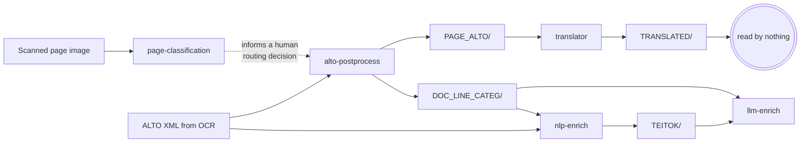
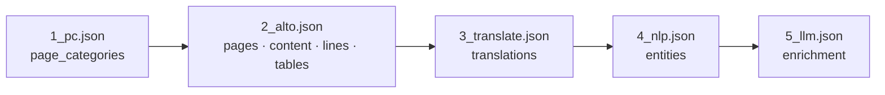

# Pipelines

What the tools do, end to end: what goes in, what each stage does, what comes out, and what
the point of it is.

!!! info "Written so far: W1, W4, W6 and W8"
    This round wrote the workflows that involve **page-classification** and the
    **translator**, the two repositories whose documentation is furthest along. The
    remaining nine are listed at the bottom with a one-line description each and will be
    written as the other three tool sections are.

## The correction this page makes

Every existing diagram in this ecosystem draws five boxes with arrows between them. That
picture is wrong in a specific and consequential way: **most of those arrows are not file
handoffs.** Verified against the tree:

* **No repository reads `TRANSLATED/`** — zero hits across all four downstream repositories.
  The translator is a terminal branch.
* **`nlp-enrich` reads `DOC_LINE_CATEG/` and the *original* `ALTO/`**, never the
  translator's output.
* **`alto-postprocess` never consumes `page_categories`.** Its only occurrences of that key
  are in the vendored schema files — deep-copy pass-through. The page classifier informs a
  **human routing decision**; it does not trigger the next stage.

The genuine file handoffs are exactly three: `PAGE_ALTO/` (alto → translator),
`DOC_LINE_CATEG/` (alto → nlp, alto → llm) and `TEITOK/` (nlp → llm).

What *is* linear is the **record**. So this page draws two layers.

### Layer 1 — the file DAG

It fans out from `alto-postprocess` and terminates at the translator.

### Layer 2 — the record accretion chain

Each stage takes `--document-json` in, writes **only the block it owns**, deep-copies
everything else, and stamps `assembled.blocks[<block>]` with its `program`, `run_id` and
`paradata_ref`. Licences are merged through `para_licenses`, so the record carries the
resolved licence of the whole chain rather than of the last writer.

Who may write what is declared once, in the hub-canonical `BLOCK_OWNERS`:

| Block                                 | Owner                                                                   |
|---------------------------------------|-------------------------------------------------------------------------|
| `pages`, `content`, `lines`, `tables` | `alto-postprocess` **or** `digital-convert`, decided by `source.origin` |
| `page_categories`                     | `page-classification`                                                   |
| `translations`                        | `translator`                                                            |
| `entities`                            | `nlp-enrich`                                                            |
| `enrichment`, `forms`                 | `llm-enrich`                                                            |

That table authorises **writes**. The read-time answer to "who wrote this block in *this*
record" is `assembled.blocks[<block>].program`, and for a field-split block
`provenance.contributors[]` — the stamp names only the most recent writer.

## The workflows

### W1 — Scanned / OCR document pipeline

**Purpose.** Take a scanned archival page and end with a searchable, enriched, FAIR record
of the document it belongs to.

**Inputs.** A page image, and — for every stage after the first — the ALTO XML produced by
OCR.

**Stages.**

| # | Stage                                                     | Reads                                    | Writes                          | Block                                 |
|---|-----------------------------------------------------------|------------------------------------------|---------------------------------|---------------------------------------|
| 1 | [page-classification](tools/page-classification/index.md) | the page image                           | a Top-N CSV                     | `page_categories`                     |
| 2 | alto-postprocess                                          | `ALTO/`                                  | `PAGE_ALTO/`, `DOC_LINE_CATEG/` | `pages`, `content`, `lines`, `tables` |
| 3 | [translator](tools/translator/index.md)                   | `PAGE_ALTO/<doc>/<doc>-N.alto.xml`       | `TRANSLATED/`                   | `translations`                        |
| 4 | nlp-enrich                                                | `DOC_LINE_CATEG/` + the original `ALTO/` | `TEITOK/`                       | `entities`                            |
| 5 | llm-enrich                                                | `DOC_LINE_CATEG/`, `TEITOK/`             | enrichment output               | `enrichment`                          |

**Outputs.** The translated document, the TEITOK XML, and one `atrium_document` record that
has accreted every stage's block — which `atrium_rocrate.py` can then map, granularity
intact, into an RO-Crate.

**What the user actually gets.** A routing decision for each page (stage 1), a cleaned
positional text layer with per-line quality scores (stage 2), an English reading of the
document (stage 3), linguistic annotation and named entities (stage 4), and
vocabulary-linked enrichment (stage 5) — with a provenance record that says which program,
at which version, produced each of them.

!!! warning "There is no way to run this as one command"
    `atrium-project/compose/docker-compose.pipeline.yml` **does not exist**. No
    cross-service orchestration exists anywhere in the ecosystem. The only working
    end-to-end definition is the CI workflow described in [W6](#w6--e2e-smoke-the-integration-contract),
    and the practical answer to "how do I run the whole pipeline?" is to copy its `docker run`
    invocations. The two this round covers are reproduced in
    [page-classification → Guide](tools/page-classification/guide.md#4--run-it-as-one-stage-of-the-pipeline)
    and [translator → Guide](tools/translator/guide.md#5--run-it-as-one-stage-of-the-pipeline).

### W4 — Containerised service / API workflow

**Purpose.** Use a tool without installing it, over HTTP, one document at a time — the mode
a web frontend, an Agent Skill or another service uses.

**Inputs.** One file per request, uploaded as multipart, optionally with a baseline
`document_json` to accrete onto.

**Stages.** Every one of the five tools publishes a `<version>-api` image from the same
Dockerfile as its batch image, and every one exposes the same meta-contract:

| Endpoint                | Guarantee                                                                               |
|-------------------------|-----------------------------------------------------------------------------------------|
| `GET /info`             | `service`, `version`, `endpoints` (the live route set), `limits` — plus per-tool extras |
| `GET /health`           | 200 while the process is alive                                                          |
| `GET /health?deep=true` | 503 with detail when a dependency is degraded, or when draining                         |
| `GET /ready`            | 503 `starting` → 200 `ready` → 503 `draining` on SIGTERM                                |

The tool-specific endpoints for the two repositories documented here:

| Tool                | Endpoints                                       | Upload cap                                                                       |
|---------------------|-------------------------------------------------|----------------------------------------------------------------------------------|
| page-classification | `POST /predict_image`, `POST /predict_document` | 10 MB, 50 PDF pages                                                              |
| translator          | `POST /translate`                               | 50 MB — the highest of the five, because ALTO XML goes in and ALTO XML comes out |

**Outputs.** JSON for the classifier; for the translator, the **document itself** as an XML
attachment, or `multipart/mixed` when a record was supplied. The translator is the one
service that does not answer with a JSON envelope, by design — it composes with `curl -o`.

**What the user actually gets.** A stateless, horizontally scalable stage: nothing is
retained between requests, so a Kubernetes `Deployment` can scale on queue depth. Error
codes are harmonised across all five services (`413`, `415`/`400`, `422`, `500`, `503`), so
a client can treat them uniformly — with the one caveat that FastAPI's `detail` is a string
for a service-raised error and a list of validation objects when FastAPI rejects the request
first.

A clean shutdown exits **143** (128 + SIGTERM) after draining for `GRACEFUL_SHUTDOWN_S`.
That is success, not failure.

See [Operations](operations.md) for deployment, and [Agent skills](agent-skills.md) for the
clients that sit on top of these endpoints.

### W6 — E2E smoke: the integration contract

**Purpose.** Prove that the five tools still compose. This is the only place the whole chain
runs, and it is therefore the de-facto specification of the pipeline.

**Inputs.** One synthetic single-page Czech document, `CTX000000003` — ALTO v3,
`LANG="cs"`, one page, two lines. There is **no committed page image**: the
page-classification stage renders one from the ALTO at run time, keeping the whole smoke
test anchored to a single fixture.

**Stages.** Five `docker run` invocations, each mounting one shared workspace and threading
the record forward: `1_pc.json` → `2_alto.json` → `3_translate.json` → `4_nlp.json` →
`5_llm.json`. Triggered on push to `main`, on dispatch, and on a cron every third day.

**The `DOC_LINE_CATEG` bridge.** The E2E config sets `SKIP_CLASSIFY = true` for
alto-postprocess, and the hub commits that stage's real output as a fixture instead —
`DOC_LINE_CATEG/CTX000000003.csv`, in alto HEAD's 37-column `CSV_HEADER` format, one
`Clear` line and one `Non-text` line.

The reason is hardware: alto-postprocess's line-categorisation step (`langID_classify.py`)
**hard-requires CUDA**, and GitHub-hosted runners have no GPU. Skipping the stage and
committing its output is what lets the remaining four stages be exercised at all — stages 4
and 5 read the bridge file directly. It is a *pinned* fixture, unlike the vocabulary, because
the assertions depend on its content.

*(This explanation is reconstructed here: `fixtures/e2e/README.md` is truncated mid-sentence
at exactly this point, after the words "`langID_classify.py` hard-requires CUDA".)*

**What a green run does and does not prove.**

!!! warning "A green E2E does not describe one coherent artifact"
    Each stage runs a **published image** selected by the `image-tag` input, but mounts
    **source checked out with no `ref:`** — that is, each tool repository's *default
    branch*, not the branch or tag the image was built from. Only the hub checkout is
    pinned, at `@v1`.

    So read a green run as: *default-branch source is compatible with that image tag*. Read
    the two together, or the claim is stronger than the evidence. Coupling `ref:` to
    `image-tag` is filed separately, because it changes what the gate means rather than
    correcting a document.

Assertions check **formats and contracts, never model quality**. Every job boundary in the
workflow is one cross-repository interface, which is the point.

### W8 — Training and evaluation (page-classification)

**Purpose.** Fine-tune, cross-validate and score a page classifier — the only workflow in the
ecosystem that produces a model rather than consuming one.

**Inputs.** A directory tree of page images, one folder per category (the label list is
derived from `sorted(os.listdir())` at run time, which is why the document schema
deliberately carries no `enum` for this field). Optionally an explicit folds CSV.

**Stages.**

1. **Split** — deterministic periodic sampling with a randomised offset, not a shuffle;
   80/10/10, or read from `--folds_csv` to reproduce a model's original split exactly, with
   pages absent from the CSV excluded.
2. **Train** — `--train`, three epochs at 5e-5, batch 8, `load_best_model_at_end` on
   accuracy. Augmentation is colour jitter, sharpness and Gaussian blur at 50 % each, and
   deliberately **no rotation or flipping**: page orientation is part of what is being read.
3. **Evaluate** — `--eval` produces a Top-N CSV with a `TRUE` column, a raw per-class CSV and
   a confusion-matrix plot at 300 dpi.
4. **Average** — `--average -ap <pattern>` averages fold weights; `--best` averages the five
   published models' *probabilities* at inference time. These are different operations.

**Outputs.** Model weights, `{stamp}_{rev}_FOLD_{n}_DATASETS.txt` recording the split
actually used, evaluation CSVs, confusion matrices, and paradata whose resolved licence is
**CC BY-NC-SA 4.0** rather than MIT — because training pulls in the LINDAT dataset.

**What the user actually gets.** A reproducible model. The fold rule
`splitN ↔ foldN ↔ seed 420+(N−1)` and `REVISION_BEST_FOLDS` mean a published revision can be
retrained on the split it originally saw, which is what made the licensed-subset retraining
measurable at all: `v*.4` differed from `v*.3` on 24 of 229 samples, all of them already
ambiguous.

Full flag reference: [page-classification → Reference](tools/page-classification/reference.md#training-and-evaluation).

## The remaining nine

Listed so the map is complete. Each will be written as its tool's section lands.

| #   | Workflow                               | What it is                                                                                                                                                                                  |
|-----|----------------------------------------|---------------------------------------------------------------------------------------------------------------------------------------------------------------------------------------------|
| W2  | Born-digital pipeline                  | Two stages, not six — a digital-born PDF or DOCX already has a text layer, so `digital-convert` originates the positional plane directly and origin-consistency refuses a second originator |
| W3  | Digital → OCR re-origination           | How a digital-born document that turns out to need OCR is re-authorised, through `needs_ocr: true` — the single exception that lets two originators coexist                                 |
| W5  | Agent-Skill workflow                   | The five `agent-skill` branches: a `SKILL.md` plus a stdlib-only client per tool, pointed at a local or hosted service by one environment variable. See [Agent skills](agent-skills.md)     |
| W7  | Vocabulary harvesting & review         | AMCR over OAI-PMH and TEATER over GraphQL into one controlled vocabulary, with a review runbook                                                                                             |
| W9  | Parameter optimisation / rule coverage | alto-postprocess's sweep over its categorisation rules                                                                                                                                      |
| W10 | Document-understanding benchmark       | llm-enrich's stratified sampling and model comparison                                                                                                                                       |
| W11 | Format adaptation via flexiconv        | Converting between ALTO, PAGE XML, hOCR and friends at the edges of the pipeline                                                                                                            |
| W12 | Annotation round trip                  | Getting human annotation back into the training and evaluation sets                                                                                                                         |
| W13 | RO-Crate export / FAIR publication     | Mapping an accreted record into RO-Crate 1.1, granularity intact. See [RO-Crate export](contracts/rocrate.md)                                                                               |

## Sources

Written from the tree at the refs below. This table records **provenance**, not a build
instruction.

| Source                                                                                             | What was taken from it                                                                                            |
|----------------------------------------------------------------------------------------------------|-------------------------------------------------------------------------------------------------------------------|
| `atrium-project/.github/workflows/e2e-pipeline-smoke.yml`                                          | W1's stage table, W6 in full, the published-image-vs-default-branch caveat, `SKIP_CLASSIFY = true`                |
| `atrium-project/fixtures/e2e/README.md`                                                            | the fixture description; the bridge explanation is **reconstructed**, because that file is truncated mid-sentence |
| `atrium-project/docs/templates/shared/atrium_document.py:108-118`                                  | `BLOCK_OWNERS`                                                                                                    |
| `atrium-project/docs/document_schema.md:125-145`                                                   | the write/read contract and the accretion rules                                                                   |
| `atrium-project/docs/skills_catalog.md`, `docs/k8s_deployment.md`                                  | W4's endpoint and limit tables                                                                                    |
| `atrium-page-classification` @ `vit` `8415ce7` — `run.py`, `setup/config.txt`, `model_registry.py` | W8                                                                                                                |
| `atrium-translator` @ `master` `88242fe` — `main.py`, `service/api.py`, `service/README.md`        | W1 stage 3, W4                                                                                                    |
