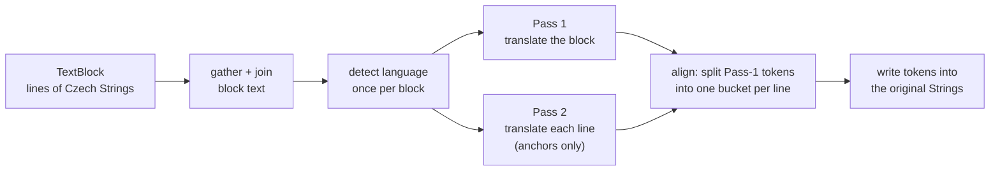

# translator — Reference

Look something up and stop reading. Every value here is taken from the code; the files it
was read from are listed under [Sources](#sources). For what the tool is and how a
translation is made, start at the [Overview](index.md).

## CLI — `main.py`

Run as `python main.py [input_path] [flags]` from the repository root. `input_path` is
positional and optional; omitted, it falls back to `config.txt`'s `input_path`.

| Flag                    | Default                                     | What it does                                                                                                                                        |
|-------------------------|---------------------------------------------|-----------------------------------------------------------------------------------------------------------------------------------------------------|
| `input_path`            | `config.txt` `input_path`                   | File or directory to translate                                                                                                                      |
| `--output`, `-o`        | `config.txt` `output`                       | Output directory                                                                                                                                    |
| `--source_lang`, `-src` | **`auto`** via `config.txt`                 | Source language, or `auto` for FastText detection                                                                                                   |
| `--target_lang`, `-tgt` | `en`                                        | Target language                                                                                                                                     |
| `--formats`             | `alto.xml` via `config.txt`                 | Comma-separated extensions, e.g. `alto.xml,txt`                                                                                                     |
| `--config`, `-c`        | `config.txt`                                | Configuration file                                                                                                                                  |
| `--alto`                | off                                         | ALTO in-place mode. **Auto-enabled** when `--formats` contains `alto.xml`                                                                           |
| `--xpaths`              | `amcr-fields.txt` via `config.txt` `fields` | File listing the AMCR XPath targets                                                                                                                 |
| `--xsd`                 | —                                           | URL or path to an XSD for output validation. **Metadata mode only**                                                                                 |
| `--vocabulary`          | `data_samples/vocabulary.csv` via config    | Vocabulary CSV (`source_lemma,target_translation`)                                                                                                  |
| `--document-json`       | —                                           | Baseline ATRIUM record to accrete onto                                                                                                              |
| `--document-json-out`   | —                                           | Where to write the updated record                                                                                                                   |
| `--download-dir`        | `<output>/downloaded_inputs`                | Where URL-ingested inputs land                                                                                                                      |
| `--output-mode`         | `replace`                                   | `replace` or `append`                                                                                                                               |
| `--fast-align`          | off                                         | ALTO only: distribute block tokens by source word count instead of translating each line as an anchor. Far fewer API calls, slightly coarser splits |
| `--backend`             | `lindat`                                    | `lindat`, `openai_compatible` or `ct2` — see [Overview → The three backends](index.md#the-three-backends)                                           |

**Exit codes:** `0` OK · `1` usage · `2` no input · `3` failed — so a Kubernetes `Job` or a
CI step sees a run that translated nothing as a failure.

**Precedence** for `--backend` and `--output-mode`: CLI flag → `config.txt` key → env var
→ built-in default.

### Other entry points

| Script                   | Purpose                                                         | Key flags                                               |
|--------------------------|-----------------------------------------------------------------|---------------------------------------------------------|
| `load_vocab.py`          | Harvest the vocabulary from AMCR (OAI-PMH) and TEATER (GraphQL) | `--out`, `--delay`, `--skip-amcr`, `--skip-teater`      |
| `eval/bakeoff.py`        | Backend comparison: reference-based and reference-free metrics  | `--samples`, `--backends`, `--refs`, `--limit`, `--out` |
| `check_version.py`       | Release gate: tag == `CITATION.cff` == `para_config.txt`        |                                                         |
| `atrium_rocrate.py`      | RO-Crate 1.1 export, its own CLI                                | `--out-dir`                                             |
| `service/healthcheck.py` | Docker healthcheck; stdlib only, always probes loopback         |                                                         |

## Configuration — `config.txt`

| Key                   | Shipped value                     |
|-----------------------|-----------------------------------|
| `input_path`          | `./data_samples/my_documents`     |
| `source_lang`         | `auto`                            |
| `target_lang`         | `en`                              |
| `formats`             | `alto.xml`                        |
| `output`              | `./data_samples/translated_files` |
| `fields`              | `amcr-fields.txt`                 |
| `vocabulary`          | `data_samples/vocabulary.csv`     |
| `translation_backend` | `lindat`                          |
| `output_mode`         | `replace`                         |

`TRANSLATION_URL` and `UDPIPE_URL` are deliberately **not** keys here — they are
environment variables, because they vary per deployment rather than per run.

`amcr-fields.txt` holds ten AMCR XPaths (`popis`, `poznamka`, `lokalizace`,
`lokalizace_okolnosti`, `souhrn_upresneni`, two `nalez_*/poznamka`, and the three
`lokalita/chranene_udaje/*` fields). `amcr-inputs.txt` holds sample OAI-PMH `GetRecord`
URLs against `https://api.aiscr.cz/2.2/oai`; a URL passed as input is downloaded to
`--download-dir` and translated like a local file.

## HTTP service

Started by `python -m service.api`. `MAX_UPLOAD_MB` defaults to **50**, sized for ALTO XML
in and ALTO XML out.

| Method | Path                     | Returns                                                                                                                   |
|--------|--------------------------|---------------------------------------------------------------------------------------------------------------------------|
| `POST` | `/translate`             | the translated document                                                                                                   |
| `GET`  | `/info`                  | `service`, `version`, `endpoints`, `limits` (`max_upload_mb: 50`), `supported_formats: ["ALTO XML", "AMCR Metadata XML"]` |
| `GET`  | `/health`                | `{"status":"ok"}`, always 200                                                                                             |
| `GET`  | `/health?deep=true`      | 503 with detail when degraded or draining — **this is where a failed FastText load is reported**                          |
| `GET`  | `/ready`                 | 503 `starting` until warm-up completes → 200 `ready` → 503 `draining` after SIGTERM                                       |
| `GET`  | `/docs`, `/openapi.json` | FastAPI built-ins                                                                                                         |

### `POST /translate`

Multipart. Every scalar is accepted as **either a form field or a query parameter**, so both
client conventions work.

| Field           | Type       | Default                                |
|-----------------|------------|----------------------------------------|
| `file`          | upload     | required; the filename must end `.xml` |
| `document_json` | upload     | optional baseline ATRIUM record        |
| `source_lang`   | form/query | `auto`                                 |
| `target_lang`   | form/query | `en`                                   |
| `is_alto`       | form/query | `true`                                 |
| `output_mode`   | form/query | `OUTPUT_MODE` env, else `replace`      |

```bash
curl -sf -F "file=@page.alto.xml" \
     "localhost:8000/translate?source_lang=cs&target_lang=en&is_alto=true" \
     -o page_en.alto.xml
```

**Response — 200**, `Content-Type: application/xml`, with
`Content-Disposition: attachment; filename="<doc>_<lang>.alto.xml"`. The body is the
translated document. There is **no JSON envelope on success, by design**: the document is
the payload, so the endpoint composes with `curl -o`.

When `document_json` is supplied the response is instead **`multipart/mixed`** with a
uuid4 boundary — the translated XML first, then the updated record, each with its own
`Content-Disposition` filename.

### Errors

| Status | When                                                                                                                                               |
|--------|----------------------------------------------------------------------------------------------------------------------------------------------------|
| `413`  | Over `MAX_UPLOAD_MB`, or the declared envelope exceeds the cap. Enforced **during** the read, so an oversized body is refused rather than buffered |
| `415`  | `Content-Type` is neither `multipart/form-data` nor `application/json`                                                                             |
| `422`  | Missing filename, a filename not ending `.xml`, or metadata mode with no readable `AMCR_FIELDS_PATH`                                               |
| `500`  | The pipeline raised — malformed XML, or the backend failed after retries                                                                           |
| `503`  | Warming up, or draining after SIGTERM. **Retryable** against another replica                                                                       |

!!! warning "`detail` is not always a string"
    Error bodies are FastAPI's `{"detail": ...}`. `detail` is a **string** for the errors
    this service raises itself, and a **list of validation objects** when FastAPI rejects
    the request before the handler runs — a `POST` with `Content-Type: application/json`
    and no `file` part returns `422` in that second shape. A client must not assume a
    string.

### Environment

`.env.example` lists every variable with its default and a comment. The ones that change
behaviour:

| Variable                                                                        | Default                | Effect                                                                              |
|---------------------------------------------------------------------------------|------------------------|-------------------------------------------------------------------------------------|
| `PORT` / `HOST`                                                                 | `8000` / `0.0.0.0`     | Bind address. `127.0.0.1` makes the container unreachable                           |
| `MAX_UPLOAD_MB`                                                                 | `50`                   | Upload cap                                                                          |
| `GRACEFUL_SHUTDOWN_S`                                                           | `20`                   | Drain window                                                                        |
| `LOG_LEVEL`                                                                     | `INFO`                 | Service log level                                                                   |
| `ALLOWED_ORIGINS`                                                               | `*`                    | Blank string means *no* origins                                                     |
| `TRANSLATION_BACKEND`                                                           | `lindat`               | Backend selection                                                                   |
| `OUTPUT_MODE`                                                                   | `replace`              | Default output mode                                                                 |
| `AMCR_FIELDS_PATH`                                                              | `amcr-fields.txt`      | XPath targets; unreadable ⇒ 422 in metadata mode                                    |
| `TRANSLATION_URL` / `UDPIPE_URL`                                                | LINDAT                 | Attachable backing services                                                         |
| `LINDAT_MIN_INTERVAL_S` / `LINDAT_MAX_RETRIES` / `LINDAT_BACKOFF_BASE_S`        | `0.0` / `4` / `1.0`    | Transport policy                                                                    |
| `LLM_BASE_URL` / `LLM_MODEL` / `LLM_API_KEY` / `LLM_PROVIDER` / `LLM_LANGUAGES` | —                      | Required by `openai_compatible`; `LLM_API_KEY` is a secret                          |
| `LLM_MAX_GLOSSARY_TERMS`                                                        | `40`                   | Vocabulary terms injected into one prompt                                           |
| `CT2_MODEL_DIR` / `CT2_MODEL_FAMILY`                                            | — / `eurollm`          | Converted model and its family: `eurollm`, `madlad`, `nllb`, `opus`                 |
| `CT2_SP_MODEL` / `CT2_DEVICE` / `CT2_COMPUTE_TYPE` / `CT2_LANGUAGES`            | — / `cpu` / `int8` / — | SentencePiece model, device, precision, language list                               |
| `*_GUARD_MIN_RATIO` / `*_GUARD_MAX_RATIO`                                       | `0.25` / `4.0`         | `LLM_` and `CT2_`: reject output shorter or longer than this multiple of the source |

Each remote backend retries a network error, HTTP 429 or 5xx up to `*_MAX_RETRIES` times,
sleeping `*_BACKOFF_BASE_S × 2^attempt` plus jitter, and spaces requests at least
`*_MIN_INTERVAL_S` apart.

## ALTO dual-pass reconstruction

Why translated ALTO looks the way it does. ALTO stores a page as blocks of lines of words,
each word a `String` with its own coordinates. A translation cannot keep a one-to-one word
correspondence — languages differ in word count and order — so the tool translates a
whole block for fluency and uses per-line translations only to decide where each line's
words go.



Per `TextBlock`:

1. **Gather** — reconstruct each `TextLine`'s text by joining its `String` `CONTENT` values.
2. **Aggregate** — concatenate the block's lines into one string.
3. **Detect** — run FastText **once for the whole block**, so the block is internally consistent.
4. **Pass 1** — translate the whole block in one call. This is the text that is written back.
5. **Pass 2** — translate each non-empty line individually. These are **never written**; they
   are structural anchors telling the aligner how many words each physical line should get.
6. **Align** — `_align_tokens_to_lines` partitions the Pass-1 tokens into one bucket per line,
   searching a ±50 % window around each line's expected word count and picking the split that
   maximises `difflib.SequenceMatcher` similarity against that line's anchor. The last line takes
   the remainder. Within a line, tokens are distributed greedily 1-to-1 across `String`
   elements, and **the last `String` absorbs everything left over**.

Guarantees: translated words never cross line boundaries, every `String` keeps its original
position, and no Pass-1 token is lost.

**Consequence.** Because tokens are bucketed per line, a `String` can end up empty or holding
several words; no box is ever resized. The word-to-box correspondence in the output is
**manufactured by the bucketing, not observed**, which is why `append` mode labels the block
rather than adding a per-`String` English alternative: that alternative would not be a reading
of that word, but whichever token the bucketing happened to land there. Read translated ALTO
line by line, not word by word.

**`--fast-align`** skips Pass 2: each line gets a share of the block's tokens proportional to
its source word count. It makes no per-line translation calls, at the price of slightly
coarser line splits.

**Cost.** `_translate_batch` sends a page's blocks as one call and its lines as another,
separated so they can be split again afterwards; when the line count does not survive the
round trip, it falls back to one call per item. Each document's log ends with a `WARNING`
summary counting clean batches, line-count mismatches and transport errors, so a slow run
explains itself.

## Metadata (AMCR) mode

Used for any XML that is not ALTO — in practice AMCR records, bare or inside an OAI-PMH
`GetRecord` envelope.

1. **Parse safely.** The parser resolves no entities, loads no DTD and makes no network
   requests, so an uploaded file cannot pull in external content.
2. **Find the namespaces.** The whole tree is scanned for the AMCR and OAI-PMH namespace
   URIs, which are bound to the prefixes `amcr:` and `oai:` whatever prefixes the file itself
   uses — so the same XPaths work on a bare record and on one wrapped in an envelope.
3. **Select the fields.** Each XPath from `amcr-fields.txt` (or `--xpaths`) is evaluated;
   every matching element with non-empty text is one unit of translation.
4. **Detect, per field.** With `auto`, each field is identified separately; a confidence at
   or below 0.2 falls back to Czech.
5. **Write back.** In `replace` mode the element's text is overwritten. In `append` mode a
   sibling with the same tag and attributes is inserted after it, marked
   `xml:lang="<target>"`, and the original is marked with its source language if it had no
   `xml:lang` — the same bilingual shape AMCR uses for its own thesaurus.
6. **Save.** Everything else — other elements, attributes, comments, whitespace — is left as
   it was; the file is written without re-indentation, so a diff against the source shows only
   the translated fields.

**`append` is idempotent.** A field that already has a target-language sibling, or is itself
one, is skipped without an API call, so re-running over an appended file changes nothing.
`replace` output carries no such marker. **`--xsd`** validates the finished metadata file
against a schema and reports failures as warnings; ALTO output is not validated.

## Vocabulary protection

Archaeological terms have fixed English equivalents that a general translation model does
not know. The translator keeps them fixed by one of two mechanisms, chosen by backend:

**Tag-and-Protect** — `lindat`:

1. **Phrases.** Multi-word vocabulary entries are found case-insensitively, longest first,
   and each occurrence is replaced by a sentinel such as `Xtermzzz0z` — a purely alphabetic
   token that translation models copy through unchanged.
2. **Words.** The text is lemmatised with UDPipe, and each single word whose lemma is in the
   vocabulary is replaced by a sentinel too — unless the word is plural, because the
   vocabulary stores singular English terms and freezing one onto a plural would break
   agreement; plurals are left for the model to translate.
3. **Translate** the protected text.
4. **Restore** each sentinel to its English term: exactly, then case-insensitively, then
   tolerating spaces the model inserted inside it. Any sentinel debris left over is removed
   before the text is written or logged.

**Glossary in the prompt** — `openai_compatible`, and `ct2` with EuroLLM: the vocabulary
entries found in the text (at most `LLM_MAX_GLOSSARY_TERMS`, longest first) are sent with
the request as `source = target` lines, with an instruction to use exactly those terms.

The `ct2` NMT families — MADLAD-400, NLLB-200 and Opus-MT — translate without vocabulary
control.

The vocabulary is a CSV of `source_lemma,target_translation`, optionally followed by
`source,source_id,uri` — which harvest a term came from and the URI of its concept, so a
protected term stays traceable. Both the two-column and the five-column form load. How
the file is built is described in [Pipelines → W7](../../pipelines.md#w7--vocabulary-harvesting--review-the-translators-half).

## Outputs

| Artefact            | Name                                                                  | Contents                                                                                                                                                                                                                                                                                                            |
|---------------------|-----------------------------------------------------------------------|---------------------------------------------------------------------------------------------------------------------------------------------------------------------------------------------------------------------------------------------------------------------------------------------------------------------|
| Translated document | `<stem>_<target_lang><suffix>` — e.g. `MTX201501307_anon_en.alto.xml` | the same document, same tags, same coordinates                                                                                                                                                                                                                                                                      |
| Translation log     | `<original_filename>_log.csv`                                         | `file, page_num, line_num, text_<source_lang>, text_<target_lang>` — **the last two column names are built from the run's languages**, so a header may read `text_auto, text_en`. ALTO: `page_num` is the 1-based page, `line_num` the `TextLine` element id. Metadata: `page_num` empty, `line_num` the full XPath |
| Paradata            | `YYMMDD-HHmmss_translator.json`                                       | schema 2.0 — tool version, run id, resolved licence with its full component derivation, timings, config (including `chunk_limit: 4000`, the language-ID model, the translation API and the 0.2 confidence threshold), statistics, and skipped files                                                                 |
| Document record     | `<doc_id>.document.json`                                              | see below                                                                                                                                                                                                                                                                                                           |
| RO-Crate            | `ro-crate-metadata.json`                                              | only from `atrium_rocrate.py`'s own CLI                                                                                                                                                                                                                                                                             |

### What lands in the document record

```json
"translations": {
  "source_lang": "cs",
  "target_lang": "en",
  "backend": "lindat",
  "output_mode": "replace"
}
```

`output_mode` rides along because `additionalProperties` is true on this block — and a
consumer that finds English in a field needs to know whether the Czech was kept beside it
or overwritten.

The translated **text** is not stored in the record. It persists as
`derived_from.translated_xml`, plus a licence-detail entry. `entities[].translation_en` is
declared for this tool in the schema but not produced: entities are written by nlp-enrich,
which runs after the translator. The record's `doc_id` is
**inherited** from the baseline and never re-derived from the input filename, because the
input is a page (`<doc>-1.alto.xml`), not the document. The output is validated before
`finalize()`, so a failed record is never emitted.

## Licence is computed, not declared

`para_config.txt` declares each component, its licence and whether it is `always` or
`conditional`; `para_licenses` resolves the run.

| Component               | Licence              | Counts when                               |
|-------------------------|----------------------|-------------------------------------------|
| `fasttext`              | CC BY-NC 4.0         | language auto-detection actually ran      |
| `lindat_cubbitt`        | CC BY-NC-SA 4.0      | the `lindat` backend was used             |
| `udpipe2_engine`        | MPL 2.0              | vocabulary lemma matching ran             |
| `udpipe2_models`        | CC BY-NC-SA 4.0      | as above                                  |
| `amcr_vocab`            | CC BY-NC 4.0         | the AMCR vocabulary was loaded            |
| `teater_data`           | CC BY-NC 4.0         | the TEATER thesaurus was loaded           |
| `llm_api`               | *"LLM provider ToS"* | the `openai_compatible` backend was used  |
| `ctranslate2`           | MIT                  | CT2 backend                               |
| `eurollm` / `madlad400` | Apache-2.0           | CT2 models                                |
| `opus_mt`               | CC BY 4.0            | CT2 model (tc-big line; older Apache-2.0) |
| `nllb200`               | CC BY-NC 4.0         | CT2 model — **non-commercial**            |

**A default run resolves to CC BY-NC-SA 4.0.** `llm_api` deliberately carries an
unrecognised licence string, so `para_licenses` treats it as maximally restrictive —
ranked highest, with both the non-commercial and share-alike flags set — and warns: the
safe default for a prototype backend whose provider terms are not a CC or OSS licence.
Every `CT2_MODEL_FAMILY` maps to one of the model rows above; an undeclared component
would be logged as `UNKNOWN`, which resolves the same way.

**The permissive recipe** — all three parts are required:

1. `--backend ct2` with a permissive model — EuroLLM or MADLAD-400 (Apache-2.0) or
   Opus-MT (CC BY 4.0), **not** NLLB-200 — see [Overview](index.md#the-three-backends);
2. an explicit `--source_lang`, so FastText never loads and its CC BY-NC weights never count;
3. a permissive or empty vocabulary, so AMCR and TEATER never count.

## Languages

`processors/identifier.py` maps ISO 639-3 → ISO 639-1 for exactly twenty languages:

`ces→cs · eng→en · fra→fr · deu→de · rus→ru · pol→pl · ukr→uk · slk→sk · bul→bg · hrv→hr ·
slv→sl · lav→lv · lit→lt · est→et · hun→hu · ron→ro · spa→es · ita→it · nld→nl · hin→hi`

Detection model: `facebook/fasttext-language-identification`, confidence threshold **0.2**.
Text is lower-cased and the first 2,000 characters are scored. In ALTO mode detection runs
once per `TextBlock`; in metadata mode once per field, falling back to Czech at or below the
threshold. If the model cannot be loaded at all, detection answers `en` with confidence 0.0
and the service reports the failure on `/health?deep=true`. Passing `--source_lang` skips
detection entirely.

UDPipe lemmatisation models are named per language — `czech-pdt-ud-2.15-241121`,
`slovak-snk-ud-2.15-241121`, `polish-pdb-ud-2.15-241121`, `german-gsd-ud-2.15-241121`,
`french-gsd-ud-2.15-241121`, `russian-syntagrus-ud-2.15-241121`,
`ukrainian-iu-ud-2.15-241121`, `english-ewt-ud-2.15-241121`. Any other source language is
not lemmatised: the single-word vocabulary pass is skipped for it, with one warning.
Multi-word vocabulary phrases are still protected.

Which language **pairs** are available depends on the backend: `lindat` reads the model
list from the LINDAT API's `/models` endpoint and offers the `<src>-<tgt>` pairs it finds —
falling back to a built-in list of six pairs into English when the API cannot be reached;
`openai_compatible` and `ct2` offer the languages listed in `LLM_LANGUAGES` /
`CT2_LANGUAGES`.

## Code map

| Module                                    | What it does                                                                                 |
|-------------------------------------------|----------------------------------------------------------------------------------------------|
| `main.py`                                 | the CLI: argument parsing, input discovery and URL download, per-file loop, record, paradata |
| `utils.py`                                | ALTO dual-pass processing, metadata processing, XSD validation, output modes                 |
| `processors/backend.py`                   | the `TranslationBackend` protocol and the backend registry                                   |
| `processors/translator.py`                | `LindatTranslator` — CUBBITT over HTTP, with Tag-and-Protect                                 |
| `processors/llm_translator.py`            | `LLMTranslator` — any OpenAI-compatible chat API, glossary in the prompt                     |
| `processors/ct2_translator.py`            | `CT2Translator` — self-hosted CTranslate2 models                                             |
| `processors/identifier.py`                | FastText language identification and the ISO 639-3 → 639-1 map                               |
| `processors/lemmatizer.py`                | UDPipe lemmatisation over HTTP                                                               |
| `processors/vocab.py`                     | vocabulary CSV loading and term matching                                                     |
| `processors/chunking.py`, `http_retry.py` | text chunking and the shared retry / throttle policy                                         |
| `service/api.py`                          | the FastAPI service around the same processing functions                                     |
| `load_vocab.py`                           | vocabulary harvesting from AMCR and TEATER                                                   |

## Design limits

These follow from how the tool works, and are worth knowing before relying on its output:

* **Word boxes in translated ALTO are approximate.** Line boundaries are exact; the placement
  of words within a line is manufactured (see above).
* **Output is not validated for ALTO.** `--xsd` applies to metadata output only.
* **No RO-Crate is produced by a run.** `atrium_rocrate.py` is a separate step, run over
  finished records; see [RO-Crate export](../../contracts/rocrate.md).
* **Language coverage is the backend's.** CUBBITT is Czech-centric; other pairs need another
  backend.
* **`entities[].translation_en` is not produced**, since entities are created later in the
  pipeline.

## Sources

Read from `ufal/atrium-translator` at branch **`master`**, commit `71feaef` (2026-09-23).
This table records **provenance**, not a build instruction.

| Source                                                       | What was taken from it                                      |
|--------------------------------------------------------------|-------------------------------------------------------------|
| `main.py` (`parse_arguments`, `main`)                        | the flag table, defaults and exit codes                     |
| `config.txt`, `para_config.txt`, `amcr-fields.txt`           | configuration and the licence component table               |
| `service/api.py`, `service/README.md`                        | limits, request fields, response shapes, errors             |
| `.env.example`                                               | the environment table and transport policy                  |
| `utils.py`                                                   | ALTO alignment, batching, metadata mode, the record block   |
| `processors/translator.py`, `llm_translator.py`, `vocab.py`  | Tag-and-Protect, the prompt glossary, the vocabulary format |
| `processors/backend.py`, `identifier.py`, `lemmatizer.py`    | the registry, language identification, UDPipe models        |
| `README.md` §§ Logic Overview, ALTO Dual-Pass Reconstruction | the six-stage algorithm                                     |
| `docs/translation-backends.md`                               | backend comparison and the permissive recipe                |
